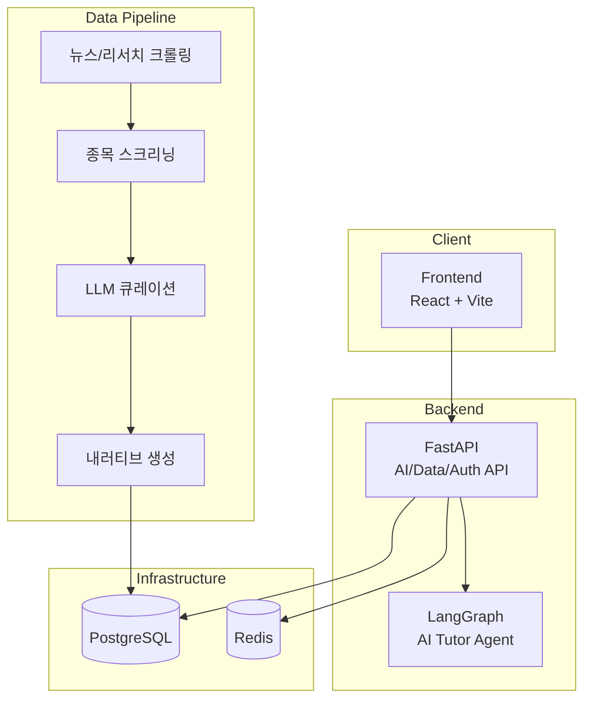

# Adelie (아델리에)

## 팀 소개

> **멋쟁이사자처럼 NLP 3기** 팀 프로젝트

<table>
  <tr>
    <td align="center">
      <a href="https://github.com/YJ99Son">
         
        <b>손영진</b>
      </a> 
      PM / Frontend 
      <b>팀장</b>
    </td>
    <td align="center">
      <a href="https://github.com/J2hoon10">
         
        <b>정지훈</b>
      </a> 
      Chatbot (AI Tutor)
    </td>
    <td align="center">
      <a href="https://github.com/ryejinn">
         
        <b>안례진</b>
      </a> 
      Data Pipeline
    </td>
  </tr>
  <tr>
    <td align="center">
      <a href="https://github.com/jjjh02">
         
        <b>허진서</b>
      </a> 
      Backend (FastAPI)
    </td>
    <td align="center">
      <a href="https://github.com/dorae222">
         
        <b>도형준</b>
      </a> 
      Infra (Docker, CI/CD)
    </td>
    <td></td>
  </tr>
</table>

---

## "History Repeats Itself" — 과거에서 배우는 금융 학습 플랫폼

한국 금융 시장의 과거 사례를 통해 현재를 이해하고, 미래를 준비하는 AI 기반 금융 학습 플랫폼입니다.

금융 시장 초보자들이 겪는 가장 큰 어려움은 "지금 무슨 일이 일어나고 있는지" 맥락을 이해하지 못하는 것입니다.
아델리에는 과거의 유사한 사례를 스토리텔링 방식으로 제공하여, 사용자가 현재 시장 상황을 직관적으로 이해할 수 있도록 돕습니다.

---

## 주요 기능

### 오늘의 키워드
매일 한국 금융 시장의 핵심 이슈를 AI가 자동 선별하여 키워드 카드로 제공합니다.

### 과거-현재 매칭 내러티브
현재 시장 이슈와 유사한 과거 사례를 찾아, 비교 분석 내러티브를 스토리텔링 형식으로 생성합니다.

### AI 튜터
금융 용어와 시장 상황을 설명해주는 AI 튜터가 대화형으로 학습을 도와줍니다.

### 모의투자
가상 포트폴리오를 통해 학습한 내용을 실전처럼 연습할 수 있습니다.

---

## 기술 스택

| 영역 | 기술 |
|------|------|
| **Frontend** | React 19, Vite, Tailwind CSS |
| **Backend** | FastAPI, SQLAlchemy (async), JWT |
| **AI/LLM** | OpenAI (GPT-4o), Perplexity (Sonar), LangGraph |
| **Database** | PostgreSQL 16 + pgvector, Redis 7 |
| **Infra** | Docker Compose, LXD, Nginx |
| **Observability** | LangSmith |

---

## 아키텍처

---

## 브랜치 구조

| 브랜치 | 용도 |
|--------|------|
| `main` | 팀/서비스 소개 (이 페이지) |
| `prod` | 프로덕션 배포 |
| `develop` | 통합 브랜치 |
| `dev/*` | 팀원별 개발 브랜치 |

> 소스코드는 `develop` 브랜치에서 확인할 수 있습니다.

---

## 문서

- [기여 가이드](docs/06_CONTRIBUTING.md)
- [Docker 가이드](docs/02_DOCKER.md)
- [AI 파이프라인](docs/05_AI_PIPELINE.md)
- [PRD (제품 요구사항)](docs/PRD.md)
