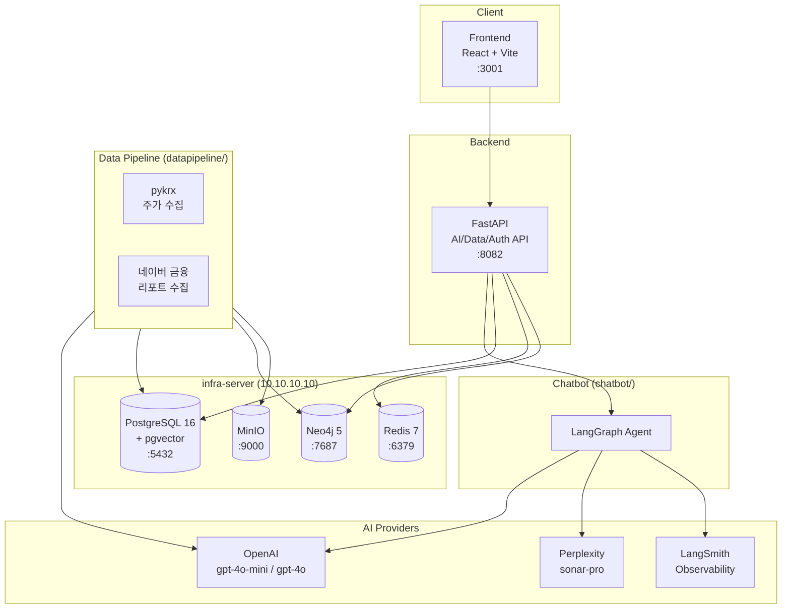

# Adelie (아델리에)

## "History Repeats Itself" - 과거에서 배우는 금융 학습 플랫폼

한국 금융 시장의 과거 사례를 통해 현재를 이해하고, 미래를 준비하는 AI 기반 금융 학습 플랫폼입니다.

금융 시장 초보자들이 겪는 가장 큰 어려움은 "지금 무슨 일이 일어나고 있는지" 맥락을 이해하지 못하는 것입니다.
아델리에는 과거의 유사한 사례를 스토리텔링 방식으로 제공하여, 사용자가 현재 시장 상황을 직관적으로 이해할 수 있도록 돕습니다.

---

## 아키텍처



---

## 기술 스택

| 영역 | 기술 | 버전 |
|------|------|------|
| **Frontend** | React, Vite, Tailwind CSS, Framer Motion | React 19, Vite 6.x, Tailwind 4.x |
| **Backend** | Python, FastAPI, LangGraph, LangChain | Python 3.11+, FastAPI 0.115+ |
| **AI/LLM** | OpenAI (gpt-4o-mini, gpt-4o), Perplexity (sonar-pro) | - |
| **Observability** | LangSmith | - |
| **Database** | PostgreSQL + pgvector, Neo4j, Redis | PG 16, Neo4j 5, Redis 7 |
| **Storage** | MinIO (S3 호환) | - |
| **Infra** | Docker Compose, LXD | - |

---

## 디렉토리 구조

```
adelie-investment/
├── frontend/                # React 19 프론트엔드 (Vite + Tailwind)
│   ├── src/
│   │   ├── components/      # UI 컴포넌트 (common, domain, layout, charts, tutor, trading)
│   │   ├── pages/           # 페이지 컴포넌트
│   │   ├── hooks/           # 커스텀 훅
│   │   ├── api/             # API 호출 모듈 (통합 index.js)
│   │   ├── contexts/        # React Context
│   │   └── styles/          # 전역 스타일
│   └── package.json
│
├── fastapi/                 # FastAPI 서버 (AI/Data/Auth API)
│   ├── app/
│   │   ├── api/routes/      # 라우터 (briefings, keywords, learning, reports, auth 등)
│   │   ├── core/            # 설정, 인증, DB
│   │   ├── models/          # SQLAlchemy ORM 모델
│   │   ├── schemas/         # Pydantic 스키마
│   │   └── services/        # 비즈니스 로직 (redis_cache 등)
│   └── requirements.txt
│
├── chatbot/                 # AI 튜터 모듈 (LangGraph 에이전트)
│   ├── agent/               # 튜터 에이전트
│   ├── tools/               # LangGraph 도구 (briefing, search, glossary 등)
│   ├── services/            # 용어 하이라이트 서비스
│   ├── prompts/             # 마크다운 프롬프트 템플릿
│   └── core/                # config, LangSmith 설정
│
├── datapipeline/            # 데이터 수집 + 케이스 생성 파이프라인
│   ├── scripts/             # 파이프라인 스크립트 (seed, generate, verify)
│   ├── ai/                  # LLM 프로바이더 클라이언트 + AI 서비스
│   ├── collectors/          # pykrx 주가, 네이버 리포트 수집기
│   ├── prompts/             # 파이프라인 프롬프트 (planner, writer, reviewer)
│   └── core/                # config, LangSmith 설정
│
├── shared/                  # 공통 모듈 (AI 설정, LangSmith 설정)
│
├── database/                # DB 마이그레이션 + 스크립트
│   ├── alembic/             # Alembic migrations
│   └── scripts/             # DB 초기화 스크립트
│
├── lxd/                     # LXD 인프라 구성 (프로파일, 인벤토리)
├── tests/                   # 테스트 (unit, backend, integration)
├── docs/                    # 문서 (PRD, 가이드)
├── .github/                 # GitHub Actions CI/CD + CODEOWNERS
└── .env.example             # 환경 변수 템플릿
```

---

## 빠른 시작 (개발환경 설정)

### 사전 요구사항

- Node.js 20+
- Python 3.11+
- Docker & Docker Compose
- infra-server (10.10.10.10) 접근 권한

### 1. 저장소 클론 및 환경 변수 설정

```bash
git clone https://github.com/404-NFYet/adelie-investment.git
cd adelie-investment

# 환경 변수 설정
cp .env.example .env
# .env 파일에서 API 키 입력 (OPENAI_API_KEY, PERPLEXITY_API_KEY, LANGCHAIN_API_KEY)
```

### 2. 개발 환경 실행

```bash
# Docker 기반 (권장) - infra-server(10.10.10.10) 연결
make dev                    # 풀스택: frontend + backend-api
make dev-frontend           # 프론트엔드만
make dev-api                # 백엔드 API만
make dev-down               # 개발 환경 중지
```

### 3. Frontend 실행

```bash
cd frontend
npm install
npm run dev    # http://localhost:3001
```

### 4. FastAPI (Backend) 실행

```bash
cd fastapi
pip install -r requirements.txt
uvicorn app.main:app --host 0.0.0.0 --port 8082 --reload
```

---

## LXD 컨테이너 및 서비스 URL

| 서비스 | URL | 설명 |
|--------|-----|------|
| Frontend | http://localhost:3001 | React 개발 서버 |
| FastAPI | http://localhost:8082 | AI/Data/Auth API |
| PostgreSQL | 10.10.10.10:5432 | 메인 DB (pgvector) |
| Redis | 10.10.10.10:6379 | 캐싱, 세션, Rate Limiting |
| Neo4j Browser | http://10.10.10.10:7474 | 그래프 DB 웹 콘솔 |
| Neo4j Bolt | bolt://10.10.10.10:7687 | 그래프 DB 연결 |
| MinIO API | http://10.10.10.10:9000 | S3 호환 스토리지 |
| MinIO Console | http://10.10.10.10:9001 | MinIO 웹 콘솔 |

---

## 환경 변수 요약

| 변수 | 설명 | 필수 입력 |
|------|------|-----------|
| `OPENAI_API_KEY` | OpenAI API 키 | Yes |
| `PERPLEXITY_API_KEY` | Perplexity API 키 | Yes |
| `LANGCHAIN_API_KEY` | LangSmith API 키 | Yes |
| `DATABASE_URL` | PostgreSQL 연결 문자열 | 기본값 제공 |
| `NEO4J_URI` / `NEO4J_PASSWORD` | Neo4j 연결 정보 | 기본값 제공 |
| `REDIS_URL` | Redis 연결 문자열 | 기본값 제공 |
| `MINIO_ENDPOINT` / `MINIO_ACCESS_KEY` / `MINIO_SECRET_KEY` | MinIO 연결 정보 | 기본값 제공 |
| `JWT_SECRET` | JWT 서명 키 | 기본값 제공 (운영 환경에서 변경 필요) |

자세한 내용은 `.env.example` 파일을 참조하세요.

---

## 팀원

<div align="center">
<table>
  <tr>
    <td align="center">
      <a href="https://github.com/YJ99Son">
        <br/>
        <sub><b>손영진</b></sub>
      </a><br/>
      <sub>PM / Frontend</sub><br/>
      <sub><b>팀장</b></sub>
    </td>
    <td align="center">
      <a href="https://github.com/J2hoon10">
        <br/>
        <sub><b>정지훈</b></sub>
      </a><br/>
      <sub>AI / Backend</sub><br/>
      <sub>팀원</sub>
    </td>
    <td align="center">
      <a href="https://github.com/ryejinn">
        <br/>
        <sub><b>안례진</b></sub>
      </a><br/>
      <sub>AI QA</sub><br/>
      <sub>팀원</sub>
    </td>
  </tr>
  <tr>
    <td align="center">
      <a href="https://github.com/jjjh02">
        <br/>
        <sub><b>허진서</b></sub>
      </a><br/>
      <sub>Backend</sub><br/>
      <sub>팀원</sub>
    </td>
    <td align="center">
      <a href="https://github.com/dorae222">
        <br/>
        <sub><b>도형준</b></sub>
      </a><br/>
      <sub>Infra</sub><br/>
      <sub>팀원</sub>
    </td>
    <td></td>
  </tr>
</table>
</div>

> 멋쟁이사자처럼 NLP 3기 팀 프로젝트

---

## 문서

- [PRD (제품 요구사항 정의서)](docs/PRD.md)
- [DB 스키마](docs/database/schema.dbml)
- [Docker 가이드](docs/02_DOCKER.md)
- [AI 파이프라인](docs/05_AI_PIPELINE.md)
- [인프라 설정 가이드](infra/README.md)
