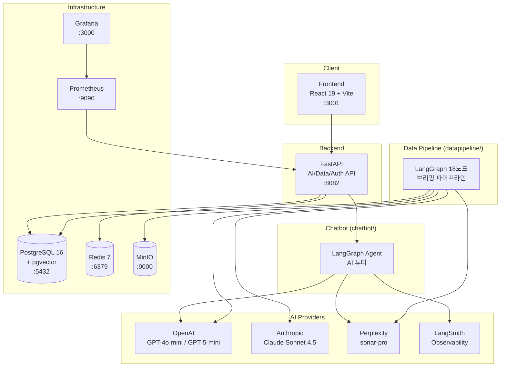

# Adelie (아델리에)

## "History Repeats Itself" - 과거에서 배우는 금융 학습 플랫폼

한국 금융 시장의 과거 사례를 통해 현재를 이해하고, 미래를 준비하는 AI 기반 금융 학습 플랫폼입니다.

금융 시장 초보자들이 겪는 가장 큰 어려움은 "지금 무슨 일이 일어나고 있는지" 맥락을 이해하지 못하는 것입니다.
아델리에는 과거의 유사한 사례를 스토리텔링 방식으로 제공하여, 사용자가 현재 시장 상황을 직관적으로 이해할 수 있도록 돕습니다.

---

## 아키텍처



---

## 주요 기능

| 기능 | 설명 |
|------|------|
| 오늘의 브리핑 | 매일 자동 수집된 뉴스/종목 데이터를 키워드 카드로 제공 |
| 과거-현재 매칭 | 현재 시장 이슈와 유사한 과거 사례를 AI가 자동 검색/매칭 |
| 내러티브 스토리 | 6섹션 스토리텔링으로 복잡한 금융 이슈를 쉽게 설명 |
| AI 튜터 | SSE 스트리밍 챗봇 — 난이도별 맞춤 금융 교육 |
| 모의 투자 | 가상 자금으로 주식 매매 체험 (지정가/시장가) |
| 차트 시각화 | Plotly/ECharts 기반 주가 차트, AI 생성 비교 차트 |

---

## 기술 스택

| 영역 | 기술 | 버전 |
|------|------|------|
| **Frontend** | React, Vite, Tailwind CSS, ECharts, Framer Motion | React 19, Vite 6.x |
| **Backend** | Python, FastAPI, LangGraph, LangChain | Python 3.11+, FastAPI 0.115+ |
| **AI/LLM** | OpenAI, Anthropic Claude, Perplexity | GPT-4o-mini, Claude Sonnet 4.5, sonar-pro |
| **Observability** | LangSmith, Prometheus, Grafana | - |
| **Database** | PostgreSQL + pgvector, Redis | PG 16, Redis 7 |
| **Storage** | MinIO (S3 호환) | - |
| **Infra** | Docker Compose, LXD, Nginx | - |
| **CI/CD** | GitHub Actions, Self-hosted Runner | - |

---

## 디렉토리 구조

```
adelie-investment/
├── frontend/                # React 19 프론트엔드 (Vite + Tailwind)
│   ├── src/
│   │   ├── components/      # UI 컴포넌트 (common, domain, layout, charts, tutor, trading)
│   │   ├── pages/           # 페이지 컴포넌트 (Landing, Home, Narrative, Portfolio...)
│   │   ├── hooks/           # 커스텀 훅
│   │   ├── api/             # API 호출 모듈
│   │   ├── contexts/        # React Context (Theme, User, Portfolio, Tutor, Term)
│   │   ├── utils/           # 유틸리티 (charts, plotly)
│   │   └── styles/          # 전역 스타일
│   └── package.json
│
├── fastapi/                 # FastAPI 서버 (AI/Data/Auth API)
│   ├── app/
│   │   ├── api/routes/      # 라우터 (briefings, keywords, tutor, auth, trading...)
│   │   ├── core/            # 설정, 인증, DB, 스케줄러
│   │   ├── models/          # SQLAlchemy ORM 모델
│   │   ├── schemas/         # Pydantic 스키마
│   │   └── services/        # 비즈니스 로직 (tutor_engine, redis_cache, code_executor)
│   └── requirements.txt
│
├── chatbot/                 # AI 튜터 모듈 (LangGraph 에이전트)
│   ├── agent/               # 튜터 에이전트
│   ├── tools/               # LangGraph 도구 (briefing, search, glossary, visualization)
│   ├── services/            # 용어 하이라이트 서비스
│   └── prompts/             # 마크다운 프롬프트 템플릿 (난이도별)
│
├── datapipeline/            # 데이터 수집 + 브리핑 생성 파이프라인
│   ├── nodes/               # LangGraph 18노드 (crawlers, screening, curation, interface, db_save)
│   ├── data_collection/     # 뉴스/리서치 크롤러, 종목 스크리너
│   ├── ai/                  # LLM 멀티 프로바이더 클라이언트
│   ├── db/                  # DB writer (asyncpg)
│   ├── prompts/             # 파이프라인 프롬프트 템플릿
│   └── run.py               # 파이프라인 진입점
│
├── database/                # DB 마이그레이션 + 스크립트
│   ├── alembic/             # Alembic migrations
│   └── scripts/             # DB 초기화 스크립트
│
├── infra/                   # 인프라 구성
│   ├── monitoring/          # Prometheus + Grafana
│   ├── localstack/          # LocalStack (AWS 테스트)
│   └── terraform/           # Terraform 모듈 (ECR, ECS, RDS, S3...)
│
├── lxd/                     # LXD 인프라 구성 (프로파일, 인벤토리)
├── tests/                   # 테스트 (unit, backend, integration, load)
├── docs/                    # 문서 (PRD, 가이드, AWS)
├── .github/                 # GitHub Actions CI/CD + CODEOWNERS
└── .env.example             # 환경 변수 템플릿
```

---

## 빠른 시작

### 사전 요구사항

- Node.js 20+
- Python 3.11+
- Docker & Docker Compose

### 1. 저장소 클론 및 환경 변수 설정

```bash
git clone https://github.com/404-NFYet/adelie-investment.git
cd adelie-investment
cp .env.example .env
# .env 파일에서 API 키 입력 (OPENAI_API_KEY, PERPLEXITY_API_KEY, LANGCHAIN_API_KEY, JWT_SECRET)
```

### 2. Docker 개발 환경 (권장)

```bash
make dev                    # 풀스택: frontend + backend-api
make dev-frontend           # 프론트엔드만
make dev-api                # 백엔드 API만
make dev-down               # 개발 환경 중지
```

### 3. 로컬 개발

```bash
# Frontend
cd frontend && npm install && npm run dev    # http://localhost:3001

# Backend
cd fastapi && pip install -r requirements.txt
uvicorn app.main:app --host 0.0.0.0 --port 8082 --reload
```

### 4. 테스트

```bash
make test                   # Backend unit tests (Docker)
make test-e2e               # Playwright E2E tests
pytest tests/ -v            # 로컬 pytest
```

### 5. 데이터 파이프라인

```bash
python -m datapipeline.run --backend live --market KR    # 실서비스
python -m datapipeline.run --backend mock                # 테스트 (LLM 미호출)
```

---

## 서비스 URL

| 서비스 | URL | 설명 |
|--------|-----|------|
| Frontend (프로덕션) | http://10.10.10.20 | Nginx SPA + 리버스 프록시 |
| FastAPI API | http://10.10.10.20:8082 | AI/Data/Auth API |
| API 문서 (Swagger) | http://10.10.10.20:8082/docs | OpenAPI 자동 문서 |
| Prometheus | http://10.10.10.10:9090 | 메트릭 수집 |
| Grafana | https://monitoring.adelie-invest.com | 모니터링 대시보드 |
| Streamlit | http://10.10.10.10:8501 | 운영 대시보드 |
| MinIO Console | http://10.10.10.10:9001 | S3 호환 스토리지 |

---

## 환경 변수

| 변수 | 설명 | 필수 |
|------|------|------|
| `OPENAI_API_KEY` | OpenAI API 키 | Yes |
| `PERPLEXITY_API_KEY` | Perplexity API 키 | Yes |
| `LANGCHAIN_API_KEY` | LangSmith API 키 | Yes |
| `JWT_SECRET` | JWT 서명 키 (기본값 없음) | Yes |
| `DATABASE_URL` | PostgreSQL 연결 문자열 | 기본값 제공 |
| `REDIS_URL` | Redis 연결 문자열 | 기본값 제공 |

자세한 내용은 `.env.example` 파일을 참조하세요.

---

## 팀 — 404 NFYet

> 멋쟁이사자처럼 NLP 3기 팀 프로젝트

<div align="center">
<table>
  <tr>
    <td align="center">
      <a href="https://github.com/YJ99Son">
        <br/>
        <sub><b>손영진</b></sub>
      </a><br/>
      <sub>PM / Frontend</sub><br/>
      <sub><b>팀장</b></sub><br/>
      <sub>React 19, Tailwind, Figma, ECharts</sub>
    </td>
    <td align="center">
      <a href="https://github.com/J2hoon10">
        <br/>
        <sub><b>정지훈</b></sub>
      </a><br/>
      <sub>AI / Backend</sub><br/>
      <sub>팀원</sub><br/>
      <sub>FastAPI, LangGraph, OpenAI API, SSE</sub>
    </td>
    <td align="center">
      <a href="https://github.com/ryejinn">
        <br/>
        <sub><b>안례진</b></sub>
      </a><br/>
      <sub>AI QA / Pipeline</sub><br/>
      <sub>팀원</sub><br/>
      <sub>pytest, Playwright, LangChain, Pydantic</sub>
    </td>
  </tr>
  <tr>
    <td align="center">
      <a href="https://github.com/jjjh02">
        <br/>
        <sub><b>허진서</b></sub>
      </a><br/>
      <sub>Backend / DB</sub><br/>
      <sub>팀원</sub><br/>
      <sub>FastAPI, SQLAlchemy, PostgreSQL, JWT</sub>
    </td>
    <td align="center">
      <a href="https://github.com/dorae222">
        <br/>
        <sub><b>도형준</b></sub>
      </a><br/>
      <sub>Infra / DevOps</sub><br/>
      <sub>팀원</sub><br/>
      <sub>Docker, LXD, Prometheus, Grafana, Terraform</sub>
    </td>
    <td></td>
  </tr>
</table>
</div>

---

## 문서

| 문서 | 설명 |
|------|------|
| [PRD](docs/reference/prd.md) | 제품 요구사항 정의서 |
| [챗봇 설계](docs/chatbot-design.md) | AI 튜터 설계 문서 |
| [LLM 모델 레퍼런스](docs/reference/llm-models.md) | 사용 모델 + 프로바이더별 가격 |
| [AWS 가이드](docs/aws/) | AWS 이전 가이드 11종 |
| [인프라 설정](infra/README.md) | LXD, Docker, 모니터링 |
