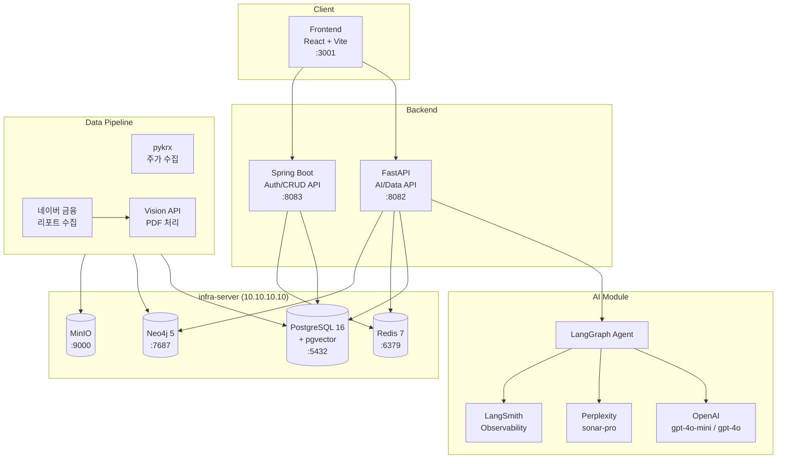

# Narrative Investment

## "History Repeats Itself" - 역사는 반복된다

주식 시장의 과거 사례를 통해 현재를 이해하고, 미래를 준비하는 AI 기반 투자 교육 플랫폼입니다.

주식 초보자들이 겪는 가장 큰 어려움은 "지금 무슨 일이 일어나고 있는지" 맥락을 이해하지 못하는 것입니다.
Narrative Investment는 과거의 유사한 사례를 스토리텔링 방식으로 제공하여, 사용자가 현재 시장 상황을 직관적으로 이해할 수 있도록 돕습니다.

---

## 아키텍처



---

## 기술 스택

| 영역 | 기술 | 버전 |
|------|------|------|
| **Frontend** | React, Vite, Tailwind CSS, Framer Motion | React 19, Vite 6.x, Tailwind 4.x |
| **Backend (AI/Data)** | Python, FastAPI, LangGraph, LangChain | Python 3.11+, FastAPI 0.115+ |
| **Backend (Auth/CRUD)** | Java, Spring Boot, Spring Security | Java 17, Spring Boot 3.x |
| **AI/LLM** | OpenAI (gpt-4o-mini, gpt-4o), Perplexity (sonar-pro) | - |
| **Observability** | LangSmith | - |
| **Database** | PostgreSQL + pgvector, Neo4j, Redis | PG 16, Neo4j 5, Redis 7 |
| **Storage** | MinIO (S3 호환) | - |
| **Infra** | Docker Compose, LXD | - |

---

## 디렉토리 구조

```
narrative-investment/
├── frontend/                # React 프론트엔드 (Vite + Tailwind)
│   ├── src/
│   │   ├── components/      # UI 컴포넌트
│   │   ├── pages/           # 페이지 컴포넌트
│   │   ├── hooks/           # 커스텀 훅
│   │   ├── api/             # API 호출 모듈
│   │   ├── contexts/        # React Context
│   │   └── styles/          # 전역 스타일
│   └── package.json
│
├── backend-api/             # FastAPI 서버 (AI/Data API)
│   ├── app/
│   │   ├── api/routes/      # 라우터 (briefing, glossary, tutor 등)
│   │   ├── core/            # 설정, 인증, DB
│   │   ├── models/          # SQLAlchemy ORM 모델
│   │   ├── schemas/         # Pydantic 스키마
│   │   └── services/        # 비즈니스 로직
│   ├── alembic/             # DB 마이그레이션
│   └── requirements.txt
│
├── backend-spring/          # Spring Boot 서버 (Auth/CRUD API)
│   └── src/main/java/com/narrative/invest/
│       ├── controller/      # REST 컨트롤러
│       ├── service/         # 서비스 계층
│       ├── model/           # JPA 엔티티
│       ├── repository/      # JPA 리포지토리
│       └── security/        # JWT 인증
│
├── ai-module/               # AI 모듈 (LangGraph 에이전트)
│   ├── agent/               # 튜터 에이전트
│   ├── tools/               # LangGraph 도구 (briefing, search, glossary 등)
│   ├── services/            # OpenAI, Perplexity, Neo4j 서비스
│   └── config/              # LangSmith 설정
│
├── data-pipeline/           # 데이터 수집 파이프라인
│   ├── collectors/          # pykrx, 네이버 리포트, Perplexity 수집기
│   ├── processors/          # PDF Vision 처리
│   ├── loaders/             # DB 로더
│   ├── services/            # MinIO, Neo4j 서비스
│   └── seed_data/           # 시드 데이터 (용어집 등)
│
├── infra/                   # 인프라 (Docker Compose)
│   ├── docker-compose.yml   # PostgreSQL, Redis, Neo4j, MinIO
│   └── setup-infra.sh       # 초기 설정 스크립트
│
├── tests/                   # 통합 테스트 / 유닛 테스트
├── docs/                    # 문서 (PRD, DB 스키마)
├── .github/                 # GitHub Actions CI/CD
└── .env.example             # 환경 변수 템플릿
```

---

## 빠른 시작 (개발환경 설정)

### 사전 요구사항

- Node.js 20+
- Python 3.11+
- Java 17+
- Docker & Docker Compose
- infra-server (10.10.10.10) 접근 권한

### 1. 저장소 클론 및 환경 변수 설정

```bash
git clone https://github.com/your-org/narrative-investment.git
cd narrative-investment

# 환경 변수 설정
cp .env.example .env
# .env 파일에서 API 키 입력 (OPENAI_API_KEY, PERPLEXITY_API_KEY, LANGCHAIN_API_KEY)
```

### 2. 인프라 서비스 시작 (infra-server)

```bash
# infra-server에 docker-compose 배포
scp -r infra/* root@10.10.10.10:/opt/narrative-investment/infra/
ssh root@10.10.10.10 "cd /opt/narrative-investment/infra && docker compose --env-file .env up -d"
```

### 3. Frontend 실행

```bash
cd frontend
npm install
npm run dev    # http://localhost:3001
```

### 4. FastAPI (Backend) 실행

```bash
cd backend-api
pip install -r requirements.txt
uvicorn app.main:app --host 0.0.0.0 --port 8082 --reload
```

### 5. Spring Boot (Backend) 실행

```bash
cd backend-spring
./gradlew bootRun    # http://localhost:8083
```

---

## LXD 컨테이너 및 서비스 URL

| 서비스 | URL | 설명 |
|--------|-----|------|
| Frontend | http://localhost:3001 | React 개발 서버 |
| FastAPI | http://localhost:8082 | AI/Data API |
| Spring Boot | http://localhost:8083 | Auth/CRUD API |
| PostgreSQL | 10.10.10.10:5432 | 메인 DB (pgvector) |
| Redis | 10.10.10.10:6379 | 캐싱, 세션, Rate Limiting |
| Neo4j Browser | http://10.10.10.10:7474 | 그래프 DB 웹 콘솔 |
| Neo4j Bolt | bolt://10.10.10.10:7687 | 그래프 DB 연결 |
| MinIO API | http://10.10.10.10:9000 | S3 호환 스토리지 |
| MinIO Console | http://10.10.10.10:9001 | MinIO 웹 콘솔 |

---

## 환경 변수 요약

| 변수 | 설명 | 필수 입력 |
|------|------|-----------|
| `OPENAI_API_KEY` | OpenAI API 키 | Yes |
| `PERPLEXITY_API_KEY` | Perplexity API 키 | Yes |
| `LANGCHAIN_API_KEY` | LangSmith API 키 | Yes |
| `DATABASE_URL` | PostgreSQL 연결 문자열 | 기본값 제공 |
| `NEO4J_URI` / `NEO4J_PASSWORD` | Neo4j 연결 정보 | 기본값 제공 |
| `REDIS_URL` | Redis 연결 문자열 | 기본값 제공 |
| `MINIO_ENDPOINT` / `MINIO_ACCESS_KEY` / `MINIO_SECRET_KEY` | MinIO 연결 정보 | 기본값 제공 |
| `JWT_SECRET` | JWT 서명 키 | 기본값 제공 (운영 환경에서 변경 필요) |

자세한 내용은 `.env.example` 파일을 참조하세요.

---

## 팀 구성

| 역할 | 이름 | 담당 업무 |
|------|------|----------|
| 팀장 | 손영진 | 기획, React UI, 프로젝트 관리 |
| AI 개발 | 정지훈 | FastAPI, LangGraph, AI 서비스 |
| AI QA | 안례진 | AI 테스트, 프롬프트 엔지니어링, LangSmith |
| 백엔드 | 허진서 | Spring Boot API, 인증, DB 설계 |
| 인프라 | 도형준 | Docker, CI/CD, 인프라 운영 |

---

## 문서

- [PRD (제품 요구사항 정의서)](docs/PRD.md)
- [DB 스키마](docs/database/schema.dbml)
- [인프라 설정 가이드](infra/README.md)
