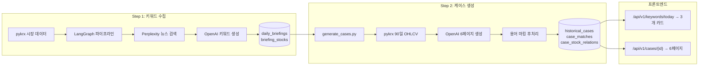
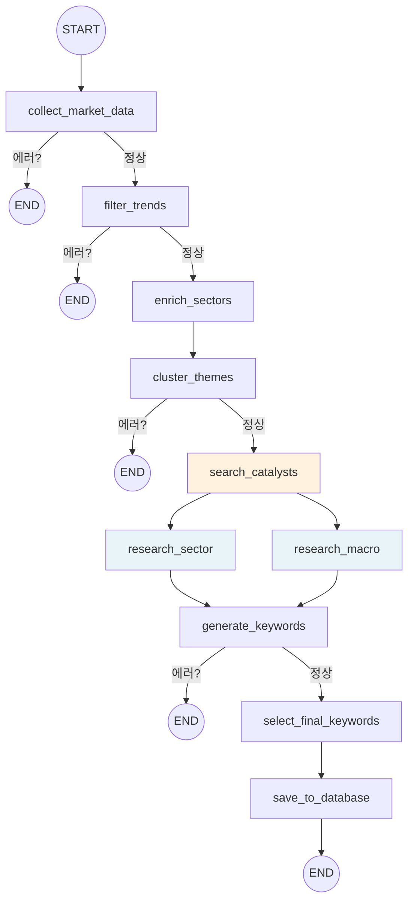

# Datapipeline

아델리 투자 플랫폼의 데이터 수집 및 콘텐츠 생성 파이프라인.
pykrx 시장 데이터를 수집하고, LLM으로 역사적 유사 사례를 매칭하여 6페이지 골든케이스를 생성한다.

---

## 목차

1. [아키텍처 개요](#1-아키텍처-개요)
2. [LangGraph 파이프라인 상세](#2-langgraph-파이프라인-상세)
3. [LangSmith 트레이싱 사용법](#3-langsmith-트레이싱-사용법)
4. [AI API 사용법 (MultiProviderClient)](#4-ai-api-사용법-multiproviderclient)
5. [3개 카드 생성 플로우](#5-3개-카드-생성-플로우)
6. [6페이지 골든케이스 상세](#6-6페이지-골든케이스-상세)
7. [Collectors (데이터 수집기)](#7-collectors-데이터-수집기)
8. [프론트엔드 연동](#8-프론트엔드-연동)
9. [로컬 실행 가이드](#9-로컬-실행-가이드)
10. [개발 가이드 (기여 방법)](#10-개발-가이드-기여-방법)

---

## 1. 아키텍처 개요

### 데이터 흐름



### 2단계 파이프라인 구조

| 단계 | 스크립트 | 입력 | 출력 | 소요 시간 |
|------|---------|------|------|----------|
| Step 1 | `keyword_pipeline_graph.py` | pykrx 5일 OHLCV | `daily_briefings` + `briefing_stocks` | 3~5분 |
| Step 2 | `generate_cases.py` | `daily_briefings.top_keywords` | `historical_cases` + `case_matches` + `case_stock_relations` | 5~10분 |

### 디렉토리 구조 및 파일 역할

```
datapipeline/
├── scripts/                        # 파이프라인 실행 스크립트
│   ├── keyword_pipeline_graph.py   # LangGraph 기반 키워드 수집 (Step 1 메인)
│   ├── seed_fresh_data_integrated.py  # Phase 1~4 유틸리티 함수
│   ├── generate_cases.py           # 6페이지 골든케이스 생성 (Step 2 메인)
│   ├── pipeline_config.py          # 공통 설정 상수 (매직넘버 관리)
│   ├── verify_keywords.py          # 키워드 검증 스크립트
│   ├── verify_history_matching.py  # 사례 매칭 검증 스크립트
│   ├── verify_api_keys.py          # API 키 유효성 확인
│   └── prompts/                    # Step 2 전용 프롬프트
│       ├── generate_case_v1.md     # 골든케이스 생성 프롬프트
│       └── term_marking_v1.md      # 용어 마킹 프롬프트
│
├── ai/                             # AI 서비스 계층
│   ├── multi_provider_client.py    # OpenAI/Perplexity/Anthropic 통합 클라이언트
│   ├── ai_service.py               # PipelineAIService (고수준 파이프라인 AI 서비스)
│   └── types.py                    # 데이터 타입 (KeywordPlan, ScenarioResult 등)
│
├── collectors/                     # 데이터 수집기
│   ├── stock_collector.py          # pykrx 주가/지수 수집 (급등락, 거래량, 히스토리)
│   ├── financial_collector.py      # PER/PBR/EPS 재무지표 수집
│   └── naver_report_crawler.py     # 네이버 증권 애널리스트 리포트 크롤링
│
├── prompts/                        # 마크다운 기반 프롬프트 시스템
│   ├── prompt_loader.py            # frontmatter 파싱 + 변수 치환 + include 해결
│   ├── __init__.py                 # load_prompt, PromptSpec 내보내기
│   └── templates/                  # 프롬프트 템플릿
│       ├── keyword_extraction.md   # 키워드 추출 (OpenAI gpt-5-mini)
│       ├── research_context.md     # 배경 리서치 (Perplexity sonar-pro)
│       ├── research_simulation.md  # 시뮬레이션 리서치 (Perplexity sonar-pro)
│       ├── planner.md              # 내러티브 기획 (OpenAI gpt-5-mini, thinking)
│       ├── writer.md               # 내러티브 작성 (Anthropic claude-sonnet-4)
│       ├── reviewer.md             # 품질 검수 (OpenAI gpt-5-mini, thinking)
│       ├── tone_corrector.md       # 해요체 톤 교정 (OpenAI gpt-5-mini)
│       ├── glossary.md             # 용어 사전 생성 (OpenAI gpt-5-mini)
│       ├── marker.md               # 용어 마킹 에이전트
│       ├── chart_template.md       # 차트 JSON 템플릿 + 예시
│       ├── _chart_skeletons.md     # 섹션별 차트 골격 (include용)
│       ├── _tone_guide.md          # 아델리에 톤 가이드 (include용)
│       └── deep_dive.md            # 심층 분석 리서치
│
├── core/                           # 핵심 설정
│   ├── config.py                   # shared.ai_config 재내보내기
│   └── langsmith_config.py         # LangSmith 트레이싱 (module_name="datapipeline")
│
├── golden_case/                    # 골든케이스 레퍼런스 샘플
│   ├── golden-sample-trump.md
│   ├── golden-sample-silver-crash.md
│   ├── golden-sample-kcontent.md
│   └── 03_k_defense.json
│
├── Dockerfile                      # Python 3.11 기반 이미지
├── requirements.txt                # 의존성
└── run_scheduled.sh                # 자동 실행 스크립트 (9:00 KST)
```

---

## 2. LangGraph 파이프라인 상세

### State 구조

`KeywordPipelineState`는 TypedDict로 정의되며, 각 노드가 state를 읽고 업데이트한다.

```python
class KeywordPipelineState(TypedDict):
    # Phase 1: 시장 데이터
    end_date_str: Optional[str]           # 최근 영업일 (YYYYMMDD)
    end_date_obj: Optional[datetime]       # datetime 객체
    raw_market_data: Optional[list]        # 5일 OHLCV DataFrame
    trending_stocks: Optional[list]        # 트렌드 감지된 종목 리스트

    # Phase 2: 섹터 클러스터링
    enriched_stocks: Optional[list]        # 섹터 정보가 추가된 종목
    theme_clusters: Optional[list]         # 전체 테마 클러스터
    selected_themes: Optional[list]        # 선택된 상위 테마 (5개)

    # Phase 3: 뉴스/분석
    stock_news_map: Optional[dict]         # 종목코드 → 카탈리스트 뉴스
    sector_analyses: Optional[dict]        # 섹터 → 심층 분석 결과
    macro_context: Optional[dict]          # 거시경제 분석 결과

    # Phase 4: 키워드 생성
    keyword_candidates: Optional[list]     # LLM 생성 키워드 후보
    final_keywords: Optional[list]         # 최종 선택 키워드 (3개)

    # 메타데이터
    openai_api_key: str
    error: Optional[str]                   # 에러 발생 시 파이프라인 중단
    metrics: Annotated[dict, ...]          # 노드별 실행 시간/상태
```

### 노드 의존 그래프



`research_sector`와 `research_macro`는 `search_catalysts` 이후 **병렬 실행**되며, 두 노드의 결과가 모두 준비된 후 `generate_keywords`가 실행된다.

### 노드 역할 요약

| 노드 | Phase | 역할 | LLM 사용 |
|------|-------|------|---------|
| `collect_market_data` | 1-1 | pykrx 5일 OHLCV 수집 (거래대금 >= 5억원) | - |
| `filter_trends` | 1-2 | 멀티데이 트렌드 감지 + RSI/MACD 계산 | - |
| `enrich_sectors` | 2-1 | stock_listings DB에서 섹터 매핑 | - |
| `cluster_themes` | 2-2 | 섹터별 테마 클러스터링 + 상위 5개 선택 | - |
| `search_catalysts` | 3-1 | Perplexity로 테마별 뉴스 검색 | Perplexity sonar-pro |
| `research_sector` | 3-2 | Perplexity 섹터 심층 분석 | Perplexity sonar-pro |
| `research_macro` | 3-3 | Perplexity 거시경제 환경 분석 | Perplexity sonar-pro |
| `generate_keywords` | 4-1 | OpenAI로 테마별 키워드 제목+설명 생성 | OpenAI gpt-4o-mini |
| `select_final_keywords` | 4-2 | 품질 점수 + 다양성(2상승+1하락) 기반 최종 3개 선택 | - |
| `save_to_database` | 5 | daily_briefings + briefing_stocks 저장 | - |

### 새 노드 추가 방법

```python
# 1. 노드 함수 정의 (@traceable 데코레이터 권장)
@traceable(name="my_new_node", run_type="tool")
def my_new_node(state: KeywordPipelineState) -> dict:
    if state.get("error"):
        return {"error": state["error"]}  # 에러 전파

    node_start = time.time()
    # ... 로직 ...
    return {
        "my_result": result,
        "metrics": _update_metrics(state, "my_new_node", time.time() - node_start),
    }

# 2. build_keyword_pipeline()에서 노드 등록 + 엣지 연결
graph.add_node("my_new_node", my_new_node)
graph.add_edge("이전_노드", "my_new_node")
graph.add_edge("my_new_node", "다음_노드")

# 3. State에 필요한 키 추가
class KeywordPipelineState(TypedDict):
    my_result: Optional[Any]
```

### 에러 핸들링

모든 노드는 `check_error` 조건부 라우팅을 통해 에러 발생 시 즉시 `END`로 종료된다. 각 노드는 내부적으로 `try/except`를 사용하며, 실패 시 `{"error": "메시지"}`를 반환한다. `enrich_sectors` 등 일부 노드는 실패해도 fallback으로 계속 진행한다.

---

## 3. LangSmith 트레이싱 사용법

### 환경변수 설정

```bash
# .env
LANGCHAIN_API_KEY=lsv2_pt_xxx
LANGCHAIN_PROJECT=adelie-investment  # 환경별 자동 접미사: -development, -production
```

`datapipeline/core/langsmith_config.py`에서 모듈 로드 시 자동으로 `setup_langsmith()`가 호출되어 환경변수가 설정된다.

### @traceable 데코레이터

```python
from langsmith import traceable

@traceable(name="generate_keywords", run_type="llm")  # run_type: llm, tool, chain
def generate_keywords_node(state):
    ...
```

`run_type`별 용도:
- `llm`: LLM API 호출 노드 (비용 추적)
- `tool`: 데이터 수집/변환 노드
- `chain`: 전체 파이프라인 래퍼

### 커스텀 메타데이터 데코레이터

```python
from datapipeline.core.langsmith_config import with_metadata

@with_metadata(run_name="keyword_gen", tags=["pipeline"], metadata={"step": 4})
def my_function():
    ...
# module_name="datapipeline" 자동 바인딩
```

### LangSmith 대시보드에서 확인하는 항목

- 노드별 실행 시간 (latency)
- LLM 토큰 사용량 + 비용
- 에러/재시도 추적
- 입출력 데이터 검사

---

## 4. AI API 사용법 (MultiProviderClient)

### 프로바이더 구성

| 프로바이더 | 모델 | 용도 | API 키 환경변수 |
|-----------|------|------|----------------|
| `openai` | `gpt-4o-mini` | 키워드 생성, 용어 마킹 | `OPENAI_API_KEY` |
| `openai` | `gpt-5-mini` | 기획, 검수, 톤 교정 (thinking 지원) | `OPENAI_API_KEY` |
| `perplexity` | `sonar-pro` | 뉴스 검색, 배경 리서치, 시뮬레이션 | `PERPLEXITY_API_KEY` |
| `anthropic` | `claude-sonnet-4-20250514` | 내러티브 작성 (writer) | `CLAUDE_API_KEY` |

### chat_completion() 인터페이스

```python
from datapipeline.ai.multi_provider_client import get_multi_provider_client

client = get_multi_provider_client()  # 싱글톤

result = client.chat_completion(
    provider="openai",           # "openai" | "perplexity" | "anthropic"
    model="gpt-4o-mini",         # 실제 모델명
    messages=[{"role": "user", "content": "..."}],
    temperature=0.7,
    max_tokens=4096,
    thinking=False,              # GPT-5 thinking 모드
    thinking_effort="medium",    # "low" | "medium" | "high"
    response_format={"type": "json_object"},  # JSON 강제 (선택)
)

# 반환값 (OpenAI 호환 형식)
content = result["choices"][0]["message"]["content"]
usage = result["usage"]  # {"prompt_tokens": N, "completion_tokens": N}
```

### 프롬프트 템플릿 시스템

프롬프트는 `datapipeline/prompts/templates/`에 마크다운 파일로 관리된다.

**frontmatter 형식:**

```markdown
---
provider: openai                  # 사용할 프로바이더
model: gpt-5-mini                 # 모델명
temperature: 0.7                  # 온도
thinking: true                    # GPT-5 thinking 모드
thinking_effort: medium           # thinking 강도
response_format: json_object      # JSON 응답 강제
max_tokens: 4096                  # 최대 토큰
system_message: >
  시스템 메시지 (여러 줄 가능)
---
{{include:_tone_guide}}           # 다른 .md 파일 인라인 삽입
{{variable}}                      # 런타임 변수 치환

프롬프트 본문...
```

**로드 방법:**

```python
from datapipeline.prompts import load_prompt

spec = load_prompt("planner", theme="반도체 급등", mirroring_hint="2018 메모리 다운사이클")
# spec.provider → "openai"
# spec.model → "gpt-5-mini"
# spec.body → 변수 치환 + include 해결된 본문
# spec.system_message → "당신은 금융 학습 내러티브 기획자입니다..."
# spec.thinking → True
```

**`_` 접두사 파일**: `_tone_guide.md`, `_chart_skeletons.md`는 직접 로드하지 않고 `{{include:_tone_guide}}` 문법으로 다른 프롬프트에 삽입된다.

---

## 5. 3개 카드 생성 플로우

### 키워드 선별 로직

Step 1 파이프라인은 최종적으로 **3개 키워드**를 선택한다. 선별 과정은 다음과 같다:

#### Phase 1: 트렌드 감지

pykrx에서 5일 OHLCV 데이터를 수집한 뒤 `calculate_trend_metrics()`로 트렌드를 감지한다.

| 트렌드 타입 | 조건 | Tier |
|------------|------|------|
| `consecutive_rise` | 최근 3일 연속 상승 | 1 |
| `consecutive_fall` | 최근 3일 연속 하락 | 1 |
| `majority_rise` | 최근 3일 중 2일 상승 | 2 |
| `majority_fall` | 최근 3일 중 2일 하락 | 2 |
| `volume_surge` | 최근 거래량이 평균의 1.5배 이상 | 3 |

#### Phase 2: 기술 지표 필터링

상위 후보(TOP_CANDIDATES=30) 종목에 대해 RSI/MACD를 계산한다.

- **RSI > 80**: 과매수 극단 → 상승 트렌드 종목에서 제외
- **MACD 골든크로스**: 상승 모멘텀 보너스 (+5점)

#### Phase 3: 종합 점수 계산

```
selection_score = (4 - tier) * 10           # Tier 보너스 (30/20/10)
                + min(10, |change_rate|)     # 변동률 보너스 (최대 10)
                + (5 if MACD 골든크로스)      # MACD 보너스
                * rotation_boost             # 섹터 로테이션 가중치 (1.0 또는 1.15)
```

#### Phase 4: 섹터 클러스터링 + 품질 점수

`cluster_by_sector()`로 섹터별 그룹화 후 `calculate_quality_score()`로 점수를 매긴다:

| 항목 | 점수 |
|------|------|
| 관련 종목 2개 이상 | +20 |
| 섹터 정보 있음 | +15 |
| mirroring_hint 있음 | +15 |
| 트렌드 일수 (일당 5점, 최대 20) | +0~20 |
| 설명에 연도 포함 (20XX) | +10 |
| 섹터 분석 존재 | +5 |
| 매크로 분석 존재 | +5 |
| 섹터 로테이션 부합 | +10 |

#### Phase 5: 2상승 + 1하락 다양성 규칙

최종 선택 시 **상승 2개 + 하락 1개** 조합을 우선한다:

```
상승 유형: consecutive_rise, majority_rise, volume_surge
하락 유형: consecutive_fall, majority_fall

if 상승 >= 2 and 하락 >= 1:
    final = 상승_상위2 + 하락_상위1
else:
    품질점수 상위 3개 fallback
```

### pipeline_config.py 주요 상수

| 상수 | 값 | 설명 |
|------|---|------|
| `TOP_CANDIDATES` | 30 | 기술지표 계산 대상 종목 수 |
| `TRENDING_TARGET` | 15 | 트렌드 선별 수 |
| `THEME_TARGET` | 5 | 테마 클러스터 수 |
| `FINAL_KEYWORDS` | 3 | 최종 키워드 수 |
| `MIN_TRENDING` | 5 | 최소 트렌딩 종목 (미달 시 에러) |
| `MIN_TRADE_VALUE` | 500,000,000 | 최소 거래대금 5억원/일 |
| `API_TIMEOUT` | 30 | LLM/Perplexity 타임아웃 (초) |
| `MAX_RETRIES` | 3 | API 재시도 횟수 |
| `SECTOR_ANALYSIS_BONUS` | 5 | 섹터 분석 존재 시 품질 보너스 |
| `MACRO_CONTEXT_BONUS` | 5 | 매크로 분석 존재 시 품질 보너스 |
| `SECTOR_ROTATION_BONUS` | 10 | 섹터 로테이션 부합 시 보너스 |
| `FALLBACK_QUALITY_SCORE` | 50 | 폴백 키워드 기본 점수 |

### 섹터 로테이션 매핑

경기 사이클(`확장기`, `정점`, `수축기`, `저점`)에 따라 유리한 섹터에 가중치를 부여한다:

| 사이클 | 유리 섹터 |
|--------|----------|
| 확장기 | IT 서비스, 전기/전자, 소프트웨어, 반도체, 미디어/교육 |
| 정점 | 에너지, 화학, 철강/금속, 조선 |
| 수축기 | 음식료/담배, 의약품, 유틸리티, 통신 |
| 저점 | 금융, 부동산, 건설, 보험 |

---

## 6. 6페이지 골든케이스 상세

### 페이지 구조

| # | page_key | 한국어 제목 | 역할 | 차트 추천 |
|---|----------|-----------|------|----------|
| 1 | `background` | 현재 배경 | 독자 주의 환기, "왜 지금 읽어야 하는지" | scatter (시계열) |
| 2 | `concept_explain` | 금융 개념 설명 | 핵심 금융 개념 1개를 초보자용으로 설명 | bar 또는 pie |
| 3 | `history` | 과거 비슷한 사례 | 과거 유사 사례를 비교하여 패턴 학습 | multi-trace scatter |
| 4 | `application` | 현재 상황에 적용 | 과거 교훈을 현재 상황에 3가지 포인트로 적용 | grouped bar |
| 5 | `caution` | 주의해야 할 점 | 반대 시나리오 3가지로 균형 잡힌 시각 | `null` (텍스트 중심) |
| 6 | `summary` | 최종 정리 | 요약 + 관찰 지표 3가지 | horizontal bar |

### 페이지별 JSON 구조

```json
{
  "background": {
    "content": "250~500자 본문 (해요체, 구체적 수치 포함)",
    "bullets": ["포인트1 (수치 포함)", "포인트2", "포인트3"],
    "chart": {
      "data": [{"x": [...], "y": [...], "type": "scatter", "name": "..."}],
      "layout": {"title": "차트 제목", "yaxis": {"title": "단위"}}
    },
    "glossary": [
      {"term": "용어명", "definition": "해요체 정의", "domain": "금융"}
    ]
  }
}
```

### 품질 기준 (pipeline_config.py)

| 항목 | 기준값 | 상수명 |
|------|--------|--------|
| 페이지별 content 최소 글자수 | 150자 | `MIN_CONTENT_LENGTH` |
| 페이지별 bullets 최소 개수 | 3개 | `MIN_BULLETS` |
| 페이지별 glossary 최소 개수 | 1개 | `MIN_GLOSSARY` |
| 6페이지 최소 고유 차트 유형 수 | 3종류 | `MIN_UNIQUE_CHART_TYPES` |
| 톤 (해요체) | 경고만, 차단하지 않음 | - |

### 차트 유형 (Plotly.js 호환)

| 차트 유형 | `type` 값 | 권장 페이지 | 비고 |
|----------|----------|-----------|------|
| 시계열 라인 | `scatter` (mode: "lines+markers") | background, history | x: 날짜, y: 지표 |
| 면적 차트 | `scatter` (fill: "tozeroy") | concept_explain | 누적 추세 |
| 세로 막대 | `bar` | application, result | 항목 비교 |
| 가로 막대 | `bar` (orientation: "h") | summary | 순위/중요도 |
| 그룹 막대 | `bar` (barmode: "group", 2 traces) | application | 과거 vs 현재 |
| 파이 | `pie` (labels, values) | concept_explain | 비율/구성 |
| 워터폴 | `waterfall` | simulation | 단계별 변화 |

차트 데이터는 반드시 **Plotly.js 호환 JSON** 형식이어야 한다. `data[0].x`와 `data[0].y`의 길이는 동일해야 하며, y값은 숫자만 허용한다. 6페이지에서 최소 3가지 다른 차트 유형을 사용해야 한다.

### 컬러 팔레트

```python
GOLDEN_COLORS = ["#FF6B35", "#004E89", "#1A936F", "#C5D86D", "#8B95A1", "#FF6B00"]
```

### 용어 마킹 프로세스

`generate_cases.py`의 `apply_term_marking()`에서 후처리로 수행된다:

1. 6페이지 전체 content를 수집
2. LLM에 전달하여 핵심 금융 용어/구문 15~25개 추출
3. 각 섹션의 content에서 첫 등장 위치에 `<mark class='term'>용어</mark>` 태그 적용
4. `key_insight`에 `term_definitions` 배열 추가

### validate_narrative() 검증 로직

`generate_cases.py`의 `validate_narrative()`는 생성된 내러티브를 검증한다:

```python
issues = validate_narrative(narrative)
# 검증 항목:
# 1. 6개 섹션(PAGE_KEYS) 모두 존재
# 2. 각 섹션이 dict 타입
# 3. content >= MIN_CONTENT_LENGTH (150자)
# 4. bullets >= MIN_BULLETS (3개)
# 5. glossary >= MIN_GLOSSARY (1개)
# 6. chart 데이터 무결성 (x/y 길이 일치, y값 숫자)
# 7. pie chart: labels/values 존재 및 길이 일치
# 8. 차트 유형 다양성 >= MIN_UNIQUE_CHART_TYPES (3종류)
# 9. 해요체 위반 경고 (합니다/입니다/했습니다 등)
```

검증 실패 시 최대 `MAX_RETRIES`(3)회 재시도하며, 실패 피드백을 프롬프트에 추가하여 품질을 개선한다.

---

## 7. Collectors (데이터 수집기)

### stock_collector.py — 주가/지수 수집

pykrx 기반으로 KOSPI/KOSDAQ 전 종목 데이터를 수집한다.

| 함수 | 입력 | 출력 | 용도 |
|------|------|------|------|
| `get_top_movers(date_str, top_n)` | 날짜, 상위 N개 | 급등/급락 종목 리스트 | 뉴스 매칭 |
| `get_high_volume_stocks(date_str, top_n)` | 날짜, 상위 N개 | 거래량 상위 종목 리스트 | 이상 거래 감지 |
| `get_market_summary(date_str)` | 날짜 | KOSPI/KOSDAQ 지수 OHLCV | 시장 요약 |
| `get_stock_history(code, days)` | 종목코드, 일수 | 기간별 OHLCV 리스트 | 차트 데이터 |

### financial_collector.py — 재무지표 수집

```python
from datapipeline.collectors.financial_collector import format_fundamentals_for_llm

text = format_fundamentals_for_llm("005930")
# [삼성전자(005930) 재무 지표 (20260212)]
#   PER: 12.50배
#   PBR: 1.30배
#   EPS: 6,000원
#   배당수익률: 2.50%
```

LLM 프롬프트에 주입하여 구체적인 재무 맥락을 제공한다.

### naver_report_crawler.py — 애널리스트 리포트

네이버 금융 리서치 페이지에서 종목분석 리포트를 크롤링한다.

```python
from datapipeline.collectors.naver_report_crawler import fetch_report_list

reports = await fetch_report_list(page=1)
# StockReport(stock_name="삼성전자", title="AI 반도체 투자 확대",
#             broker="삼성증권", target_price="100,000", opinion="매수",
#             pdf_url="...", date="2026.02.12")
```

`generate_cases.py`의 `fetch_stock_data()`에서 자동으로 호출되어 관련 종목의 애널리스트 리포트를 LLM 컨텍스트에 추가한다.

---

## 8. 프론트엔드 연동

### API 엔드포인트

#### GET `/api/v1/keywords/today` -- 오늘의 키워드 3개

**요청 파라미터:** `?date=YYYYMMDD` (선택, 기본값: 오늘)

**응답 JSON:**

```json
{
  "date": "20260212",
  "market_summary": "KOSPI 2,650.00, KOSDAQ 850.00",
  "keywords": [
    {
      "id": 1,
      "category": "consecutive_rise",
      "title": "반도체 수출 호조",
      "description": "삼성전자/SK하이닉스 연속 상승...",
      "sector": "반도체",
      "stocks": [
        {"stock_code": "005930", "stock_name": "삼성전자", "reason": "연속 상승 3일"}
      ],
      "trend_days": 3,
      "trend_type": "consecutive_rise",
      "catalyst": "뉴스 제목",
      "catalyst_url": "https://...",
      "catalyst_source": "Perplexity",
      "mirroring_hint": "2018년 메모리 다운사이클...",
      "quality_score": 85,
      "case_id": 42,
      "case_title": "2018년 반도체 사이클",
      "event_year": 2018,
      "sync_rate": 75,
      "past_event": {"year": 2018, "title": "...", "label": "2018"},
      "present_label": "2026"
    }
  ]
}
```

해당 날짜에 데이터가 없으면(주말/공휴일) 가장 최근 데이터로 폴백한다. 결과는 Redis에 5분간 캐시된다.

#### GET `/api/v1/story/{case_id}` -- 케이스 스토리

6페이지 내러티브 데이터를 `historical_cases.keywords` JSONB에서 추출하여 반환한다. `keywords.narrative`에 6페이지가 포함되어 있다.

#### GET `/api/v1/comparison/{case_id}` -- 과거-현재 비교

`keywords.comparison`에서 `past_metric`, `present_metric`, `sync_rate`, `key_insight`를 추출한다. `key_insight`는 `{summary, term_definitions[]}` 구조이다.

#### GET `/api/v1/companies/{case_id}` -- 관련 기업

`case_stock_relations` 테이블에서 관련 종목 정보를 조회한다. `relation_type`은 `main_subject` 또는 `related`이다.

### React 컴포넌트 흐름

```
KeywordCard (오늘의 카드 3개)
  → 사용자 클릭
    → CaseDetail (6페이지 스와이프)
      → 각 페이지: content + bullets + chart(Plotly) + glossary
      → 용어 클릭 → <mark class='term'> → 용어 팝업
```

### Plotly 차트 렌더링

프론트엔드에서 `chart.data`와 `chart.layout`을 그대로 Plotly.js에 전달한다:

```jsx
<Plot
  data={page.chart.data}
  layout={{
    ...page.chart.layout,
    autosize: true,
    margin: { l: 40, r: 20, t: 40, b: 40 },
  }}
  config={{ displayModeBar: false, responsive: true }}
/>
```

---

## 9. 로컬 실행 가이드

### 사전 요구사항

1. Docker DB 실행 (PostgreSQL, Redis 등)
2. `.env` 파일에 API 키 설정
3. Alembic 마이그레이션 완료

### 환경 설정

```bash
# 1. 가상환경 활성화
cd /home/hj/2026/project/adelie-investment
source .venv/bin/activate

# 2. 의존성 설치
pip install -r datapipeline/requirements.txt

# 3. 환경변수 확인
python datapipeline/scripts/verify_api_keys.py

# 4. DB 마이그레이션
cd database && alembic upgrade head && cd ..
```

### Step 1 실행 (키워드 수집)

```bash
# LangGraph 파이프라인 실행
.venv/bin/python datapipeline/scripts/keyword_pipeline_graph.py

# 또는 Docker 컨테이너에서
docker exec adelie-backend-api python /app/scripts/keyword_pipeline_graph.py
```

### Step 2 실행 (케이스 생성)

```bash
# 6페이지 골든케이스 생성
.venv/bin/python datapipeline/scripts/generate_cases.py

# 또는 Docker 컨테이너에서
docker exec adelie-backend-api python /app/scripts/generate_cases.py
```

### 전체 파이프라인 (자동 실행)

```bash
# run_scheduled.sh (lock 파일로 동시 실행 방지)
bash datapipeline/run_scheduled.sh
```

### Dry-run 모드

`PipelineAIService`는 `dry_run=True`로 초기화하면 LLM 호출 없이 더미 데이터를 반환한다:

```python
from datapipeline.ai.ai_service import PipelineAIService

service = PipelineAIService(dry_run=True)
keywords = service.extract_top_keywords("뉴스 헤드라인...")
# LLM 호출 없이 3개 더미 키워드 반환
```

### 개별 Collector 테스트

```python
from datapipeline.collectors.stock_collector import get_top_movers, get_market_summary

# 급등/급락 종목 조회
movers = get_top_movers("20260212", top_n=5)
print(movers["gainers"])

# 시장 요약
summary = get_market_summary("20260212")
print(summary["kospi"])
```

### 검증 스크립트

```bash
# 키워드 검증
.venv/bin/python datapipeline/scripts/verify_keywords.py

# 사례 매칭 검증
.venv/bin/python datapipeline/scripts/verify_history_matching.py
```

---

## 10. 개발 가이드 (기여 방법)

### 새 프롬프트 추가

1. `datapipeline/prompts/templates/`에 `.md` 파일 생성
2. frontmatter에 provider, model, temperature 등 명시
3. `{{variable}}` 플레이스홀더로 런타임 변수 정의
4. 공통 톤 가이드가 필요하면 `{{include:_tone_guide}}` 추가

```markdown
---
provider: openai
model: gpt-4o-mini
temperature: 0.5
response_format: json_object
system_message: >
  시스템 메시지
---
{{include:_tone_guide}}

프롬프트 본문... {{my_variable}}
```

로드 방법:

```python
from datapipeline.prompts import load_prompt

spec = load_prompt("my_new_prompt", my_variable="값")
```

### 새 Collector 추가

1. `datapipeline/collectors/`에 파일 생성
2. 비동기 함수는 `async def`, 동기 함수는 `def`로 정의
3. 반환값은 dict 또는 dataclass
4. `generate_cases.py`의 `fetch_stock_data()`에서 import하여 LLM 컨텍스트에 주입

```python
# datapipeline/collectors/my_collector.py

async def fetch_my_data(code: str) -> dict:
    """내 데이터 수집기."""
    # ...
    return {"code": code, "data": ...}
```

### 품질 튜닝 (pipeline_config.py)

품질 기준을 조정하려면 `datapipeline/scripts/pipeline_config.py`의 상수를 수정한다:

```python
# 최종 키워드 수 변경 (3 → 5)
FINAL_KEYWORDS = 5

# 콘텐츠 품질 기준 상향
MIN_CONTENT_LENGTH = 200   # 150 → 200자
MIN_BULLETS = 4            # 3 → 4개

# 차트 다양성 기준 상향
MIN_UNIQUE_CHART_TYPES = 4  # 3 → 4종류
```

주의: `FINAL_KEYWORDS`를 변경하면 프론트엔드의 카드 레이아웃도 함께 확인해야 한다.

### 테스트 실행

```bash
# 전체 유닛 테스트
make test

# 특정 테스트 파일
pytest tests/unit/test_pipeline.py -v

# 특정 테스트 함수
pytest tests/unit/test_pipeline.py::test_validate_narrative -v
```

### 주의사항

- Docker 내부는 **Python 3.11**, 로컬은 **Python 3.12** -- 버전 차이 주의
- `.env` 파일의 API 키를 절대 커밋하지 않음
- `PERPLEXITY_API_KEY` 미설정 시 뉴스 검색/섹터 분석이 스킵됨 (파이프라인 자체는 정상 실행)
- pykrx는 한국 시간(KST) 기준으로 동작하며, 15:30 이후에만 당일 데이터 조회 가능
- 골든케이스 생성 시 LLM 재시도가 발생하면 프롬프트에 검증 실패 피드백이 누적됨 (토큰 비용 증가)
