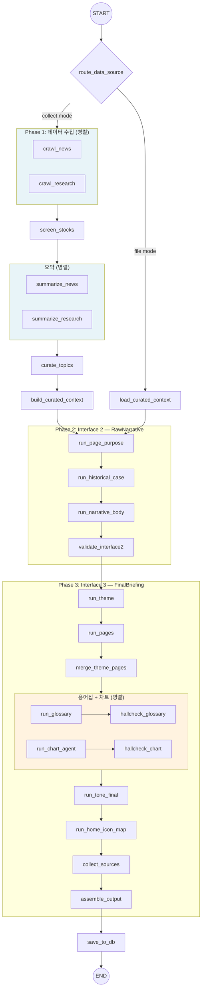

# Datapipeline

아델리 플랫폼의 **18노드 LangGraph 브리핑 파이프라인**.
뉴스/리서치 크롤링 → 종목 스크리닝 → LLM 큐레이션 → 3-Interface 내러티브 생성 → DB 저장까지 자동화합니다.

## 목차

1. [개요](#1-개요)
2. [파이프라인 흐름](#2-파이프라인-흐름)
3. [노드 상세](#3-노드-상세)
4. [AI 프로바이더](#4-ai-프로바이더)
5. [프롬프트 템플릿](#5-프롬프트-템플릿)
6. [실행 방법](#6-실행-방법)
7. [프론트엔드 연동](#7-프론트엔드-연동)
8. [Collectors (레거시)](#8-collectors-레거시)
9. [개발 가이드](#9-개발-가이드)

## 1. 개요

### BriefingPipelineState

파이프라인 전체가 공유하는 LangGraph TypedDict State입니다.

| 그룹 | 주요 필드 | 설명 |
|------|-----------|------|
| 입력 | `input_path`, `topic_index`, `backend`, `market` | 실행 모드 결정 |
| 데이터 수집 | `raw_news`, `raw_reports`, `screened_stocks`, `matched_stocks` | 크롤링/스크리닝 중간 결과 |
| 큐레이션 | `news_summary`, `research_summary`, `curated_topics` | LLM 요약 및 토픽 |
| Interface 1 | `curated_context` | CuratedContext (종목, 뉴스, 컨셉) |
| Interface 2 | `page_purpose`, `historical_case`, `narrative`, `raw_narrative` | 테마, 과거 사례, 6섹션 내러티브 |
| Interface 3 | `i3_theme`, `i3_pages`, `charts`, `pages`, `sources` | 최종 6페이지 + 차트 + 용어집 |
| 출력 | `full_output`, `db_result`, `error`, `metrics` | 최종 JSON, DB 저장 결과 |

### 3-Interface 아키텍처

```
Interface 1: CuratedContext
  → 종목, 뉴스, 리포트, 컨셉을 하나의 패키지로 묶음

Interface 2: RawNarrative
  → 테마, 과거 유사사례, 6섹션 내러티브 본문

Interface 3: FinalBriefing
  → 6페이지 레이아웃 + Plotly 차트 + 용어집 + 출처 + 팩트체크
```

### 디렉토리 구조

```
datapipeline/
├── graph.py                # LangGraph StateGraph 정의
├── run.py                  # 파이프라인 실행 진입점
├── config.py               # 환경변수 기반 설정 (KST, 모델, 경로)
├── schemas.py              # Pydantic 스키마 (CuratedContext, RawNarrative, FinalBriefing)
├── nodes/                  # LangGraph 노드
│   ├── crawlers.py         # crawl_news, crawl_research
│   ├── screening.py        # screen_stocks
│   ├── curation.py         # summarize_news/research, curate_topics, build_curated_context
│   ├── interface1.py       # load_curated_context (파일 모드)
│   ├── interface2.py       # page_purpose, historical_case, narrative_body, validate
│   ├── interface3.py       # theme, pages, glossary, hallcheck, tone, home_icon, sources, assemble
│   ├── chart_agent.py      # chart_agent, hallcheck_chart (async)
│   └── db_save.py          # save_to_db
├── data_collection/        # 뉴스/리서치 크롤러, 종목 스크리너
├── ai/                     # LLM 멀티 프로바이더 클라이언트
│   ├── multi_provider_client.py  # OpenAI, Perplexity, Anthropic
│   └── llm_utils.py
├── db/                     # DB writer (asyncpg)
│   └── writer.py
├── collectors/             # 레거시 pykrx 수집기
├── prompts/
│   ├── prompt_loader.py    # frontmatter 파싱 + 변수 치환 + include
│   └── templates/          # 20개 마크다운 프롬프트
└── Dockerfile              # Python 3.11 기반
```

## 2. 파이프라인 흐름


```mermaid
flowchart TD
    START((START)) --> ROUTE{route_data_source}

    ROUTE -->|file mode| LOAD[load_curated_context]
    ROUTE -->|collect mode| COLLECT

    subgraph COLLECT["Phase 1: 데이터 수집 (병렬)"]
        CN[crawl_news] & CR[crawl_research]
    end

    COLLECT --> SCREEN[screen_stocks]
    SCREEN --> SUMMARIZE

    subgraph SUMMARIZE["요약 (병렬)"]
        SN[summarize_news] & SR[summarize_research]
    end

    SUMMARIZE --> CURATE[curate_topics]
    CURATE --> BUILD[build_curated_context]

    BUILD --> PP[run_page_purpose]
    LOAD --> PP

    subgraph IF2["Phase 2: Interface 2 — RawNarrative"]
        PP --> HC[run_historical_case]
        HC --> NB[run_narrative_body]
        NB --> VAL[validate_interface2]
    end

    VAL --> THEME[run_theme]

    subgraph IF3["Phase 3: Interface 3 — FinalBriefing"]
        THEME --> PAGES[run_pages]
        PAGES --> MERGE[merge_theme_pages]
        MERGE --> PARALLEL

        subgraph PARALLEL["용어집 + 차트 (병렬)"]
            GL[run_glossary] --> GLH[hallcheck_glossary]
            CA[run_chart_agent] --> CAH[hallcheck_chart]
        end

        PARALLEL --> TONE[run_tone_final]
        TONE --> ICON[run_home_icon_map]
        ICON --> SRC[collect_sources]
        SRC --> ASM[assemble_output]
    end

    ASM --> SAVE[save_to_db]
    SAVE --> END1((END))

    style COLLECT fill:#e8f4f8
    style SUMMARIZE fill:#e8f4f8
    style PARALLEL fill:#fff3e0
```

### 에러 핸들링

모든 노드는 `check_error()` 조건부 라우팅으로 에러 발생 시 즉시 `END`로 종료됩니다.
각 노드 내부에서 `try/except` 후 `{"error": "메시지"}`를 반환하면 이후 노드를 건너뜁니다.

## 3. 노드 상세

### 데이터 수집 (nodes/crawlers.py, screening.py, curation.py)

| 노드 | 역할 | LLM |
|------|------|-----|
| `crawl_news` | 뉴스 크롤링 (RSS, 네이버 금융) | - |
| `crawl_research` | 리서치 리포트 크롤링 | - |
| `screen_stocks` | 가격 시그널 기반 종목 필터링 | - |
| `summarize_news` | 뉴스 요약 | OpenAI gpt-5-mini |
| `summarize_research` | 리서치 요약 | OpenAI gpt-5-mini |
| `curate_topics` | 토픽 큐레이션 (테마 선정) | Perplexity sonar-pro |
| `build_curated_context` | CuratedContext 조립 | - |
| `load_curated_context` | 파일에서 CuratedContext 로드 (파일 모드) | - |

### Interface 2 (nodes/interface2.py)

| 노드 | 역할 | LLM |
|------|------|-----|
| `run_page_purpose` | 테마, one-liner, 컨셉 추출 | Anthropic claude-sonnet-4-6 |
| `run_historical_case` | 과거 유사사례 생성 | Anthropic claude-sonnet-4-6 |
| `run_narrative_body` | 6섹션 내러티브 본문 생성 | Anthropic claude-sonnet-4-6 |
| `validate_interface2` | RawNarrative 구조 검증 | - |

### Interface 3 (nodes/interface3.py, chart_agent.py)

| 노드 | 역할 | LLM |
|------|------|-----|
| `run_theme` | Interface 3용 테마/one-liner 생성 | Anthropic claude-sonnet-4-6 |
| `run_pages` | 6페이지 상세 콘텐츠 생성 | Anthropic claude-sonnet-4-6 |
| `merge_theme_pages` | 테마 + 페이지 병합 | - |
| `run_glossary` | 금융 용어 추출 | Anthropic claude-sonnet-4-6 |
| `hallcheck_glossary` | 용어집 정확성 검증 | Anthropic claude-sonnet-4-6 |
| `run_chart_agent` | 6개 Plotly 차트 생성 (async) | OpenAI gpt-5-mini |
| `hallcheck_chart` | 차트 정확성 검증 (실패 시 null 게이팅) | Anthropic claude-sonnet-4-6 |
| `run_tone_final` | 해요체 톤 교정 | Anthropic claude-sonnet-4-6 |
| `run_home_icon_map` | 홈 피드용 아이콘 선택 | Anthropic claude-sonnet-4-6 |
| `collect_sources` | 출처 URL 수집 | - |
| `assemble_output` | FullBriefingOutput JSON 조립 | - |

### DB 저장 (nodes/db_save.py)

| 노드 | 역할 | 대상 테이블 |
|------|------|------------|
| `save_to_db` | asyncpg로 PostgreSQL 저장 | `daily_briefings`, `briefing_stocks`, `historical_cases`, `case_matches`, `case_stock_relations` |

- `daily_briefings`: 날짜 기준 UPSERT (재실행 안전)
- Advisory lock으로 동시 실행 방지
- 트랜잭션 기반 all-or-nothing

## 4. AI 프로바이더

`datapipeline/ai/multi_provider_client.py`에서 3개 프로바이더를 통합 관리합니다.

| 프로바이더 | 모델 | 용도 | 동시 호출 제한 |
|-----------|------|------|--------------|
| Anthropic | claude-sonnet-4-6 | Interface 2/3 내러티브 생성, 검증, 톤 교정 | 2 |
| OpenAI | gpt-5-mini | 차트 생성, 뉴스/리서치 요약 | 4 |
| Perplexity | sonar-pro | 웹 검색, 토픽 큐레이션 | 2 |

### 동시성 관리

```python
LLM_MAX_CONCURRENCY = 6      # 전체 세마포어
PROVIDER_MAX_RETRIES = 1      # 재시도 (429, 503, 504)
LLM_TIMEOUT = 180             # 타임아웃 (초)
```

### LLM 관측성

`ai/llm_observability.py`에서 호출 수, 토큰 사용량, 프롬프트별 통계를 추적합니다.
LangSmith 트레이싱과 연동됩니다.

## 5. 프롬프트 템플릿

`datapipeline/prompts/templates/`에 마크다운 + YAML frontmatter 형식으로 관리됩니다.

### Frontmatter 형식

```markdown
---
provider: anthropic
model: claude-sonnet-4-6
temperature: 0.3
response_format: json_object
thinking_budget: 10000
system_message: >
  시스템 메시지
---
{{include:_tone_guide}}
{{variable}}

프롬프트 본문...
```

### 템플릿 목록 (20개)

**Interface 2 (내러티브 원본)**

| 파일 | 용도 | 프로바이더 |
|------|------|-----------|
| `page_purpose.md` | 테마, one-liner, 컨셉 추출 | Anthropic |
| `historical_case.md` | 과거 유사사례 생성 | Anthropic |
| `narrative_body.md` | 6섹션 내러티브 본문 | Anthropic |
| `hallucination_check.md` | 내러티브 팩트체크 | Anthropic |
| `final_hallucination.md` | 최종 팩트체크 | Anthropic |
| `glossary_generation.md` | 용어 사전 생성 | Anthropic |

**Interface 3 (최종 브리핑)**

| 파일 | 용도 | 프로바이더 |
|------|------|-----------|
| `3_theme.md` | 테마/one-liner 정제 | Anthropic |
| `3_pages.md` | 6페이지 상세 콘텐츠 | Anthropic |
| `3_glossary.md` | 용어집 추출 | Anthropic |
| `3_glossary_term_extraction.md` | 용어 추출 (대안) | Anthropic |
| `3_hallcheck_glossary.md` | 용어집 검증 | Anthropic |
| `3_hallcheck_pages.md` | 페이지 팩트체크 | Anthropic |
| `3_tone_final.md` | 해요체 톤 교정 | Anthropic |
| `3_home_icon_map.md` | 홈 아이콘 매핑 | Anthropic |
| `3_chart_reasoning.md` | 차트 구조 추론 | Anthropic |
| `3_chart_generation.md` | Plotly JSON 생성 | OpenAI |
| `3_hallcheck_chart.md` | 차트 검증 | Anthropic |

**유틸리티**

| 파일 | 용도 |
|------|------|
| `chart_generation.md` | 레거시 차트 템플릿 |
| `_chart_skeletons.md` | 차트 레이아웃 예시 (`{{include:}}` 전용) |
| `_tone_guide.md` | 아델리에 톤 가이드 (`{{include:}}` 전용) |

### 로드 방법

```python
from datapipeline.prompts import load_prompt

spec = load_prompt("3_pages", narrative=narrative_body, curated=curated_context)
# spec.provider → "anthropic"
# spec.model → "claude-sonnet-4-6"
# spec.body → 변수 치환 + include 해결된 본문
```

`_` 접두사 파일은 직접 로드하지 않고 `{{include:_tone_guide}}` 문법으로 다른 프롬프트에 삽입됩니다.

## 6. 실행 방법

### CLI

```bash
# 실서비스 (한국 시장, 3개 토픽)
python -m datapipeline.run --backend live --market KR --topic-count 3

# 테스트 (LLM 미호출, 더미 응답)
python -m datapipeline.run --backend mock

# 파일 모드 (데이터 수집 건너뜀)
python -m datapipeline.run --backend live --input output/curated_ALL_20260227.json --topic-index 0
```

### 실행 모드

| 모드 | 설명 |
|------|------|
| `--backend live` | 실제 API 호출 (API 키 필요) |
| `--backend mock` | 더미 데이터 반환 (구조 검증용, 비용 없음) |
| `--backend auto` | API 키 존재 시 live, 없으면 mock |

### 멀티 토픽 실행

`--topic-count 3`(기본)을 지정하면:
1. Topic 1: 전체 파이프라인 (크롤링 → 큐레이션 → 내러티브 → DB 저장)
2. Topic 2+: 중간 `curated_ALL` 파일 재로드 → Interface 2/3 → DB 저장

### 환경변수

```bash
# 필수 API 키 (.env)
OPENAI_API_KEY=sk-...
PERPLEXITY_API_KEY=pplx-...
ANTHROPIC_API_KEY=sk-ant-...
LANGCHAIN_API_KEY=lsv2_pt_...    # LangSmith 트레이싱

# 선택
DATABASE_URL=postgresql+asyncpg://...  # 미설정 시 DB 저장 스킵
```

### 스케줄러

`fastapi/app/core/scheduler.py`에서 APScheduler로 매일 KST 08:00 자동 실행.
Discord 알림, 영업일 체크, 타임아웃 60분 설정.

## 7. 프론트엔드 연동

### API 엔드포인트

| 메서드 | 경로 | 설명 |
|--------|------|------|
| GET | `/api/v1/keywords/today?date=YYYYMMDD` | 오늘의 키워드 카드 (최대 3개) |
| GET | `/api/v1/story/{case_id}` | 6페이지 내러티브 스토리 |
| GET | `/api/v1/comparison/{case_id}` | 과거-현재 비교 데이터 |
| GET | `/api/v1/companies/{case_id}` | 관련 기업 목록 |

### GET `/api/v1/keywords/today` 응답

```json
{
  "date": "20260227",
  "market_summary": "KOSPI 2,650.00, KOSDAQ 850.00",
  "keywords": [
    {
      "id": 1,
      "title": "반도체 수출 호조",
      "description": "삼성전자/SK하이닉스 연속 상승...",
      "sector": "반도체",
      "stocks": [
        {"stock_code": "005930", "stock_name": "삼성전자", "reason": "연속 상승 3일"}
      ],
      "case_id": 42,
      "case_title": "2018년 반도체 사이클",
      "quality_score": 85
    }
  ]
}
```

주말/공휴일에는 가장 최근 영업일 데이터로 폴백. Redis 5분 캐시.

### React 컴포넌트 흐름

```
KeywordCard (오늘의 카드 3개)
  → 사용자 클릭
    → CaseDetail (6페이지 스와이프)
      → 각 페이지: content + bullets + chart(Plotly) + glossary
      → 용어 클릭 → <mark class='term'> → 용어 팝업
```

## 8. Collectors (레거시)

> `datapipeline/collectors/`는 레거시 pykrx 기반 수집기입니다.
> FastAPI에서 `sys.path.insert`로 import하는 호환 레이어입니다.

| 파일 | 역할 |
|------|------|
| `stock_collector.py` | pykrx 주가/지수 수집 (급등락, 거래량, 히스토리) |
| `financial_collector.py` | PER/PBR/EPS 재무지표 수집 |
| `naver_report_crawler.py` | 네이버 증권 애널리스트 리포트 크롤링 |

현행 파이프라인에서는 `data_collection/` 모듈이 데이터 수집을 담당합니다.

## 9. 개발 가이드

### 노드 추가

1. `datapipeline/nodes/`에 노드 함수 작성
2. `graph.py`의 `build_pipeline()`에서 노드 등록 + 엣지 연결
3. `schemas.py`에 필요한 State 필드 추가

```python
# 노드 함수 패턴
def my_new_node(state: BriefingPipelineState) -> dict:
    if state.get("error"):
        return {"error": state["error"]}  # 에러 전파

    node_start = time.time()
    # ... 로직 ...
    return {
        "my_result": result,
        "metrics": _update_metrics(state, "my_new_node", time.time() - node_start),
    }
```

### 프롬프트 추가

1. `datapipeline/prompts/templates/`에 `.md` 파일 생성
2. YAML frontmatter에 provider, model, temperature 등 명시
3. `{{variable}}` 플레이스홀더로 런타임 변수 정의
4. 공통 톤 가이드: `{{include:_tone_guide}}` 추가

```python
from datapipeline.prompts import load_prompt

spec = load_prompt("my_prompt", my_variable="값")
# spec.provider, spec.model, spec.body 등 사용
```

### 테스트

```bash
# mock 모드로 구조 검증 (LLM 미호출)
python -m datapipeline.run --backend mock

# 단위 테스트
pytest datapipeline/tests/ -v

# 전체 테스트
make test
```

### 주의사항

- Docker 내부는 **Python 3.11**, 로컬은 **Python 3.12** — 버전 차이 주의
- `.env` 파일의 API 키를 절대 커밋하지 않음
- KST 기준 날짜: `date.today()` 사용 금지 → `kst_today()` 사용
- `PERPLEXITY_API_KEY` 미설정 시 뉴스 검색이 스킵됨
