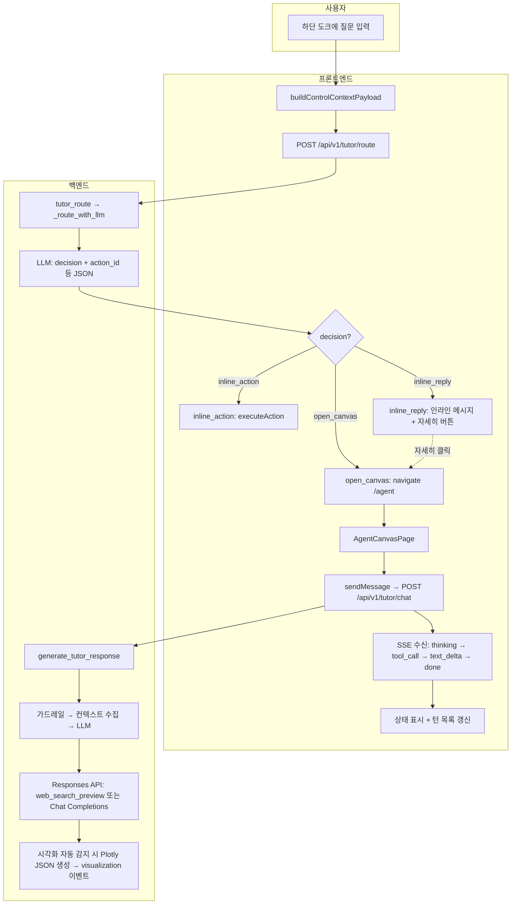
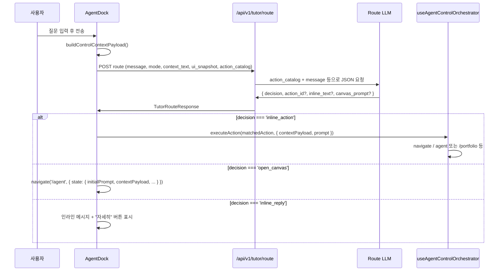
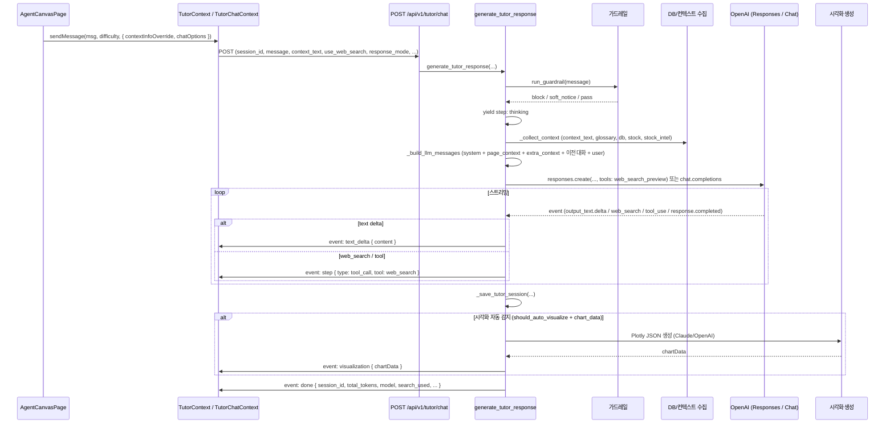

# 에이전트 캔버스·도크·툴 호출 유저 플로우

에이전트(튜터)의 **캔버스**, **하단 도크(AgentDock)**, **라우팅**, **툴 호출**이 어떻게 연결되는지 정리한 문서입니다.

---

## 1. 개요

| 구분 | 설명 |
|------|------|
| **에이전트 도크(AgentDock)** | 앱 하단에 항상 노출되는 입력바. 사용자 질문을 받아 **라우터 API**로 보내고, 결과에 따라 **인라인 처리** 또는 **캔버스 전환**을 결정한다. |
| **에이전트 캔버스** | `/agent` 전용 페이지. 스트리밍 채팅 + 턴 단위 스와이프 탐색 + 요약/근거/액션 중심 레이아웃을 제공한다. |
| **라우터(/api/v1/tutor/route)** | 사용자 메시지·모드·ui_snapshot·action_catalog를 받아 **inline_action** / **inline_reply** / **open_canvas** 중 하나를 반환한다. |
| **채팅(/api/v1/tutor/chat)** | SSE 스트리밍으로 `thinking` → `tool_call`(웹검색 등) → `text_delta` → (선택) `visualization` → `done`을 보낸다. |

---

## 2. 화면·경로 구조

```
┌─────────────────────────────────────────────────────────────┐
│  홈 / 투자(포트폴리오) / 교육 / 마이  (BottomNav)              │
├─────────────────────────────────────────────────────────────┤
│                                                             │
│  [현재 탭 콘텐츠: 홈 카드, 종목 상세, 교육 캘린더 등]          │
│                                                             │
├─────────────────────────────────────────────────────────────┤
│  AgentDock (하단 고정)                                        │
│  ┌─────────────────────────────────────────────────────┐   │
│  │ ● 상태문구 │ [검색토글] [기록]  │ [추천] [입력창] [전송] │   │
│  └─────────────────────────────────────────────────────┘   │
└─────────────────────────────────────────────────────────────┘

캔버스 진입 시:  navigate('/agent', { state: { initialPrompt, contextPayload, useWebSearch, ... } })
```

- **AgentDock**: 모든 탭에서 공통. 입력 시 **반드시** `POST /api/v1/tutor/route` 호출.
- **AgentCanvasPage** (`/agent`): 라우터가 `open_canvas`를 주거나, 사용자가 "자세히"로 진입했을 때만 표시.

---

## 3. 유저 플로우 (전체)



---

## 4. 도크에서의 플로우 (라우팅)

사용자가 도크에 입력하고 전송하면 다음 순서로 진행된다.

### 4.1 컨텍스트 페이로드 생성

- **buildControlContextPayload(prompt)** (AgentDock 내)에서 다음을 묶는다.
  - **baseContextPayload**: `location.state.stockContext` / `sessionStorage.adelie_home_context` / `adelie_education_context` 등 모드별 데이터.
  - **ui_snapshot**: `buildUiSnapshot({ pathname, mode, visibleSections, selectedEntities, filters, portfolioSummary })`  
    → 라우트, 모드, 보이는 섹션, 선택된 종목/날짜/케이스 ID 등.
  - **action_catalog**: `buildActionCatalog({ pathname, mode, stockContext })`  
    → 실행 가능한 액션 목록(id, label, risk, description 등).
  - **interaction_state**: source=`agent_dock`, mode, route, last_prompt, search_enabled, control_phase 등.

### 4.2 라우터 API 요청·응답

| 항목 | 내용 |
|------|------|
| **URL** | `POST /api/v1/tutor/route` |
| **Request** | `message`, `mode`, `context_text`, `ui_snapshot`, `action_catalog`, `interaction_state` |
| **Response** | `decision`, `action_id`, `inline_text`, `canvas_prompt`, `confidence`, `reason` |

- **decision**
  - **inline_action**: `action_id`에 해당하는 액션을 **바로 실행** (예: 탭 이동, 캔버스 열기).
  - **inline_reply**: 짧은 안내만 하고, 필요 시 "자세히"로 캔버스 이동.
  - **open_canvas**: 캔버스로 이동하며 `canvas_prompt`(또는 원문)로 채팅 시작.

### 4.3 프론트 분기

- **inline_action**  
  - `useAgentControlOrchestrator`의 `actionCatalog`에서 `decision.action_id`와 일치하는 액션을 찾아 `executeAction(action, { contextPayload, prompt })` 실행.  
  - 예: `nav_home`, `nav_portfolio`, `open_stock_agent`, `open_home_issue_agent` 등.
- **open_canvas**  
  - `navigate('/agent', { state: { mode, initialPrompt, contextPayload, useWebSearch, resetConversation } })`.
- **inline_reply**  
  - 인라인 메시지 영역에 `inline_text` 표시 + "자세히" 버튼(클릭 시 `submitPromptToCanvas(inlineMessage.canvasPrompt)`).

---

## 5. 에이전트 캔버스 내부 플로우

캔버스(`/agent`)에 들어오면 `AgentCanvasPage`가 다음을 수행한다.

### 5.1 진입 시 상태

- `location.state`에서 `mode`, `initialPrompt`, `contextPayload`, `useWebSearch`, `resetConversation`, `sessionId` 등을 읽음.
- `resetConversation`이 true면 `clearMessages()`로 대화 초기화.
- `initialPrompt`가 있으면 자동으로 첫 질문으로 `sendMessage` 호출(또는 사용자가 입력 후 전송).

### 5.2 채팅 요청 시 컨텍스트

- **buildContextInfoForPrompt(focusedPrompt)**  
  - `buildAgentContextEnvelope({ mode, pathname, contextPayload, userPrompt, searchEnabled })`로 envelope 구성.
  - envelope: `mode`, `context`, `ui_snapshot`, `action_catalog`, `interaction_state` (source=`agent_canvas`).
- **contextInfo**  
  - `type`(briefing/case 등), `id`, **stepContent** = 위 envelope의 **JSON 문자열**.
- `sendMessage(message, difficulty, { chatOptions, contextInfoOverride })` 호출 시 `contextInfoOverride`에 이 객체를 넘기면, `/chat` 요청의 **context_text**에 `contextInfo.stepContent`(JSON 문자열)가 실린다.

### 5.3 캔버스 UI 상태

- **assistantTurns**: 턴 단위로 `{ assistantText, userPrompt, uiActions, model, structured, guardrailNotice, … }` 저장.
- **activeTurnIndex**: 스와이프로 이전/다음 턴 선택.
- **composeCanvasState**: 현재 선택 턴 기준으로 `viewType`, `rawAssistantText`, `actions`, `aiStatus` 등을 묶어 `AgentCanvasSections`에 전달.

---

## 6. 툴 호출이 일어나는 두 가지 경로

에이전트에서 "툴"이 관여하는 곳은 **두 가지**다.

1. **라우터 쪽 액션 실행 (인라인 액션)**  
   - 백엔드가 `decision: inline_action`, `action_id`를 주면, 프론트가 **action_catalog**에서 매칭 액션을 찾아 **executeAction**으로 실행(탭 이동, 캔버스 열기, 포트폴리오 조회 등).  
   - 이건 **백엔드가 도구를 호출하는 것**이 아니라, **백엔드가 “이 액션을 실행해라”라고 지시**하고, **프론트가 라우팅/내비게이션/API 호출**로 수행하는 구조다.

2. **채팅 스트리밍 안의 툴 (웹 검색, 시각화)**  
   - `/api/v1/tutor/chat`의 `generate_tutor_response` 내부에서 **OpenAI Responses API**의 `web_search_preview` 또는 일반 Completions로 응답을 만들고,  
   - 스트리밍 중 **web_search** 사용 시 `tool_call` 이벤트를 보내며,  
   - 응답 완료 후 **시각화 자동 감지**가 되면 Plotly JSON을 만들어 **visualization** SSE 이벤트로 보낸다.  
   - 이쪽이 “에이전트가 툴을 호출한다”는 의미에 가까운 부분이다.

아래는 1번(인라인 액션)과 2번(채팅 내 툴/이벤트)을 구분한 도식이다.

---

## 7. 인라인 액션(도크 쪽 툴) 플로우



- **action_catalog** 예: `nav_home`, `nav_portfolio`, `nav_education`, `open_agent_history`, `open_home_issue_agent`, `open_stock_agent`, `check_portfolio`, `check_stock_quote` 등.
- **executeAction**은 `action.id`에 따라 `navigate(...)` 또는 내부 API 호출 후 결과를 반환한다.  
  - 고위험 액션은 `window.confirm` 후 실행.

---

## 8. 채팅 내 툴 호출·SSE 이벤트 (백엔드 → 프론트)



### 8.1 SSE 이벤트 타입 (프론트 처리)

| event (또는 data.type) | 의미 | 프론트 동작 |
|------------------------|------|-------------|
| **thinking** | 분석 중 | agentStatus: phase=thinking |
| **tool_call** | 도구 실행 중 (웹검색 등) | agentStatus: phase=tool_call, text=도구 실행 중 |
| **guardrail_notice** | 소프트 가드레일 안내 | 해당 턴에 guardrailNotice 저장 |
| **text_delta** | 스트리밍 텍스트 조각 | 버퍼 모아서 assistant 메시지에 반영 |
| **visualization** | Plotly 차트 JSON | 해당 턴에 차트 데이터 저장·렌더 |
| **done** | 턴 종료 | session_id, total_tokens, model, search_used 등 저장 |
| **error** | 오류 | 오류 메시지 표시 |

### 8.2 백엔드에서의 “툴” 사용

- **웹 검색**: `request.use_web_search === true`이고 `TUTOR_USE_RESPONSES_API`일 때, `client.responses.create(..., tools=[{"type": "web_search_preview"}])`로 전달.  
  스트림에서 `web_search` 관련 이벤트가 오면 `tool_call` SSE를 한 번 보냄.
- **시각화**: 응답 본문이 있고 `should_auto_visualize(message, detected_stocks)` 또는 이미 수집된 `chart_data`가 있으면, 별도 LLM(Claude/OpenAI)으로 Plotly JSON을 생성한 뒤 **visualization** 이벤트로 내려줌.  
  프론트는 이걸 턴에 붙여 `AgentCanvasSections` 등에서 Plotly 컴포넌트로 그린다.

---

## 9. 데이터 계약 요약

### 9.1 Route 요청 (AgentDock → 백엔드)

- **message**, **mode**, **context_text**, **ui_snapshot**, **action_catalog**, **interaction_state**를 보냄.
- **context_text**: `buildControlContextPayload` 결과 전체를 **JSON.stringify**한 문자열. (동일 내용이 `ui_snapshot`, `action_catalog`, `interaction_state`로 개별 필드에도 들어감.)
- 캔버스에서 채팅 시에는 **context_text**에 `buildAgentContextEnvelope` 결과의 JSON 문자열이 들어감.

### 9.2 Chat 요청 (캔버스 → 백엔드)

- **context_text**: 캔버스에서는 `contextInfo.stepContent` = `buildAgentContextEnvelope(...)` 결과의 **JSON 문자열**.
- **use_web_search**, **response_mode** (`canvas_markdown` 등), **structured_extract** 등은 chatOptions으로 전달.

### 9.3 ui_snapshot / action_catalog (공통)

- **ui_snapshot**: `route`, `mode`, `visible_sections`, `selected_entities`, `filters`, `portfolio_summary`, `location_state`, `captured_at`.
- **action_catalog**: `{ id, label, risk?, description? }` 배열. 라우터는 여기 있는 `id`만 `action_id`로 반환할 수 있음.

---

## 10. 코드 위치 참고

| 역할 | 파일 |
|------|------|
| 도크 UI·라우팅 분기 | `frontend/src/components/agent/AgentDock.jsx` |
| 라우터 API | `fastapi/app/api/routes/tutor.py` (`tutor_route`, `_route_with_llm`) |
| 라우터 스키마 | `fastapi/app/schemas/tutor.py` (`TutorRouteRequest`, `TutorRouteResponse`) |
| 채팅 스트리밍 | `fastapi/app/api/routes/tutor.py` (`tutor_chat`, `generate_tutor_response`) |
| SSE 이벤트 스키마 | `fastapi/app/schemas/tutor.py` (`TutorChatEvent`) |
| 인라인 액션 실행 | `frontend/src/hooks/useAgentControlOrchestrator.js` |
| ui_snapshot 생성 | `frontend/src/utils/agent/buildUiSnapshot.js` |
| action_catalog 생성 | `frontend/src/utils/agent/buildActionCatalog.js` |
| 캔버스 페이지 | `frontend/src/pages/AgentCanvasPage.jsx` |
| 캔버스 턴/섹션 | `frontend/src/components/agent/AgentCanvasSections.jsx` |
| 채팅 전송·SSE 처리 | `frontend/src/contexts/TutorChatContext.jsx` |
| Tutor 래퍼·sendMessage | `frontend/src/contexts/TutorContext.jsx` |
| 캔버스 상태 조합 | `frontend/src/utils/agent/composeCanvasState.js` |

---

이 문서는 에이전트 캔버스·도크·라우팅·툴 호출의 **유저 플로우**와 **기술적 데이터/이벤트 흐름**을 한곳에 정리한 것입니다.  
상세 스펙은 `changes/agent-canvas-v3-yj99son.md` 및 `fastapi/app/api/routes/tutor.py` 주석을 함께 참고하면 됩니다.

---

## 11. 주문 실행 후 실제 반영 체인 (v7.2)

`tool` 버튼으로 매수/매도가 실행될 때, UI 반영이 누락되지 않도록 체인을 고정했습니다.

1. `AgentCanvasSections`/`AgentCanvasPage`에서 `type: tool` 액션 클릭
2. `useAgentControlOrchestrator.executeAction()` 실행
3. `GET /api/v1/trading/stocks/{code}`로 현재가 확인
4. 사용자 확인 모달 통과 시 `POST /api/v1/trading/order` 실행
5. 주문 성공 직후 `refreshPortfolio(true)` 실행
6. 최신 요약/보유 종목을 재조회해 컨텍스트 반영
7. 캔버스/도크 상태 라인에 실행 완료 표시

핵심은 **주문 API 성공**만으로 끝내지 않고, **포트폴리오 재조회**를 후행시키는 것입니다.

### 11-1. 왜 필요한가

- 기존에는 주문 응답은 성공했지만 화면 데이터가 즉시 갱신되지 않아 사용자가 "실행이 안 됐다"고 인지할 수 있었습니다.
- 현재는 `refreshPortfolio(true)`가 체인에 포함되어 즉시 반영됩니다.

### 11-2. 실패 케이스 처리

- 확인 모달 취소: `cancelled` 반환, 상태 라인에 취소 메시지 표시
- 주문 실패(잔고/검증/서버): 오류 메시지 그대로 노출
- 저위험 네비 액션 실패 시 이전 경로 복원
