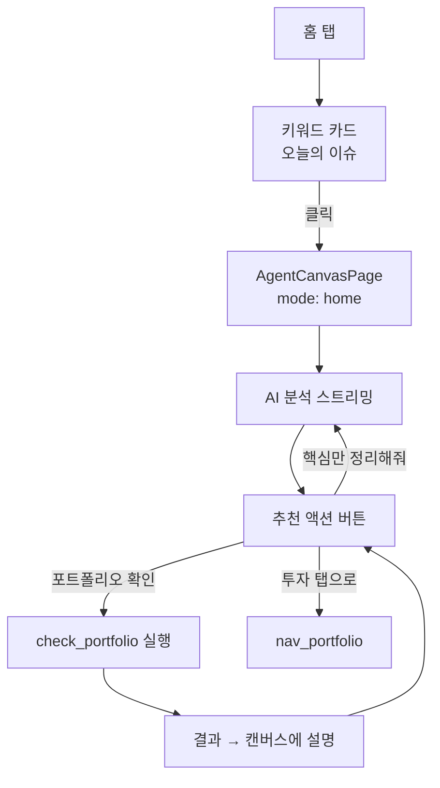
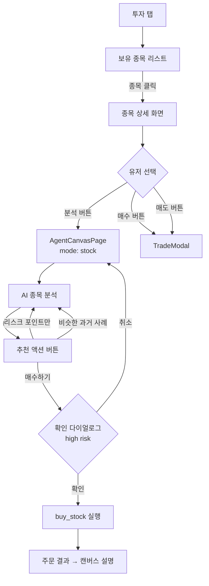
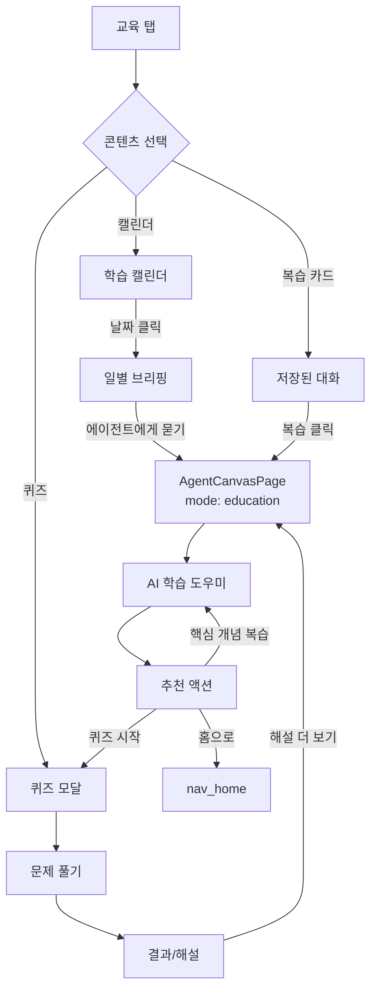
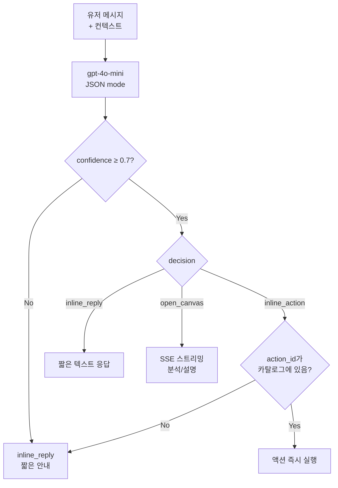
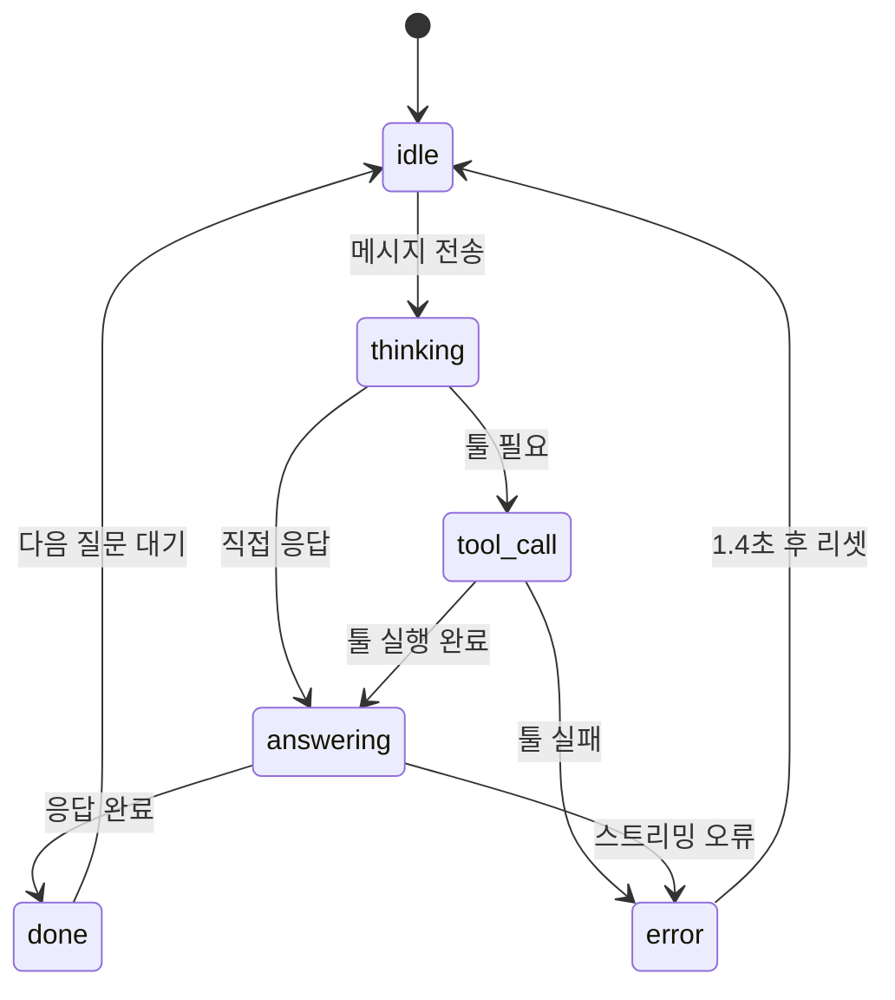
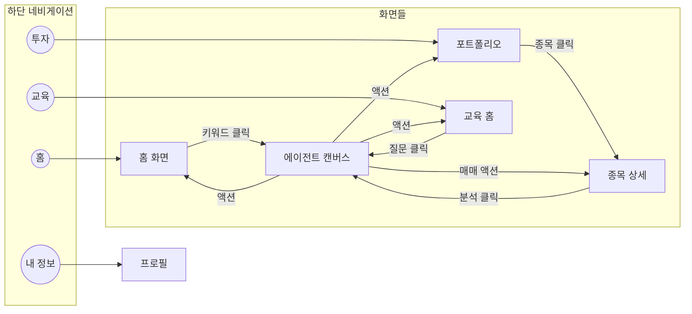
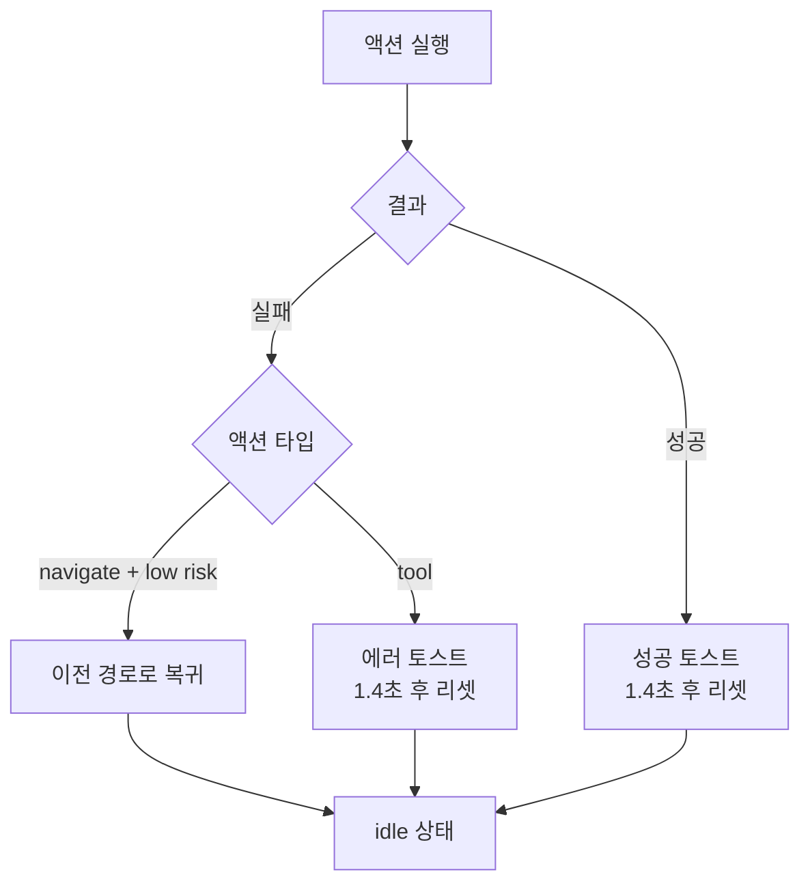

# 에이전트 UX 명세서

> 최종 업데이트: 2026-02-23

이 문서는 Adelie Investment 에이전트 시스템의 **유저 플로우**, **기능 명세**, **기능 간 연결 구조**를 정리합니다.
에이전트가 제어하여 유저가 끊기지 않는 경험을 제공하기 위한 설계 기준입니다.

---

## 목차

1. [유저가 사용하는 기능 개요](#1-유저가-사용하는-기능-개요)
2. [유저 여정별 기능 흐름](#2-유저-여정별-기능-흐름)
3. [에이전트 제어 기능 명세](#3-에이전트-제어-기능-명세)
4. [기능 간 연결 구조](#4-기능-간-연결-구조)
5. [끊기지 않는 경험을 위한 설계 원칙](#5-끊기지-않는-경험을-위한-설계-원칙)
6. [Figma 다이어그램 링크](#6-figma-다이어그램-링크)

---

## 1. 유저가 사용하는 기능 개요

### 1.1 진입점 (Entry Points)

유저가 에이전트와 만나는 3가지 경로:

| 진입점 | 화면 | 트리거 | 에이전트 모드 |
|--------|------|--------|--------------|
| **홈 이슈** | 홈 탭 | 키워드 카드 클릭 | `mode: home` |
| **종목 분석** | 투자 탭 → 종목 상세 | "분석" 버튼 클릭 | `mode: stock` |
| **학습 도우미** | 교육 탭 | 복습 카드 / 퀴즈 해설 | `mode: education` |
| **언제든 질문** | 모든 화면 | ChatFAB (우하단 버튼) | 튜터 모달 → 캔버스 |

### 1.2 유저가 수행하는 액션

```
┌─────────────────────────────────────────────────────────────────────┐
│                        유저 액션 분류                                │
├─────────────────────────────────────────────────────────────────────┤
│                                                                     │
│  👆 직접 입력                                                        │
│  ├── 메시지 입력 → 에이전트에게 질문                                  │
│  ├── 텍스트 선택 → "이거 설명해줘" (SelectionAskChip)                 │
│  └── 스와이프 → 이전/다음 응답 탐색                                   │
│                                                                     │
│  🔘 버튼 클릭                                                        │
│  ├── 추천 액션 버튼 → 후속 질문 or 기능 실행                          │
│  ├── 저장 버튼 → 복습 카드로 저장                                     │
│  ├── 다시 생성 → 응답 재생성                                         │
│  └── 중단 버튼 → 스트리밍 중단                                        │
│                                                                     │
│  ✅ 확인 액션                                                        │
│  └── 확인 다이얼로그 → 고위험 액션(매매) 승인/거절                     │
│                                                                     │
└─────────────────────────────────────────────────────────────────────┘
```

---

## 2. 유저 여정별 기능 흐름

### 2.1 홈에서 시작하는 여정



**이 여정에서 사용되는 기능:**
- `open_home_issue_agent`: 캔버스 진입
- `check_portfolio`: 포트폴리오 조회
- `nav_portfolio`, `nav_education`: 탭 이동
- 후속 프롬프트: "핵심만 정리해줘", "이 내용 더 쉽게 설명해줘"

### 2.2 투자 탭에서 시작하는 여정



**이 여정에서 사용되는 기능:**
- `open_stock_agent`: 종목 분석 캔버스 진입
- `check_stock_price`: 현재 시세 조회
- `buy_stock`, `sell_stock`: 매매 주문 (확인 필요)
- `limit_buy_stock`: 지정가 매수
- `open_external_stock_info`: 외부 정보 링크

### 2.3 교육 탭에서 시작하는 여정



**이 여정에서 사용되는 기능:**
- `start_quiz`: 퀴즈 시작
- `open_learning_history`: 학습 아카이브 이동
- `nav_home`, `nav_education`: 탭 이동

---

## 3. 에이전트 제어 기능 명세

### 3.1 액션 카탈로그

에이전트가 선택/추천할 수 있는 모든 기능:

#### 네비게이션 (navigate)

| ID | 라벨 | 위험도 | 설명 |
|----|------|--------|------|
| `nav_home` | 홈으로 이동 | low | 홈 탭으로 전환 |
| `nav_portfolio` | 투자 탭으로 이동 | low | 투자 탭으로 전환 |
| `nav_education` | 교육 탭으로 이동 | low | 교육 탭으로 전환 |
| `nav_profile` | 프로필 보기 | low | 내 정보 페이지 |
| `nav_search` | 검색하기 | low | 검색 화면 |
| `nav_feedback` | 피드백 보내기 | low | 피드백 페이지 |
| `open_agent_history` | 대화 기록 열기 | low | 과거 대화 목록 |
| `open_learning_history` | 학습 히스토리 | low | 학습 아카이브 |
| `open_home_issue_agent` | 오늘 이슈 분석 | low | 홈 컨텍스트 캔버스 |
| `open_stock_agent` | 종목 분석 캔버스 | low | 종목 컨텍스트 캔버스 |
| `start_quiz` | 퀴즈 시작 | low | 오늘의 퀴즈 |
| `open_external_stock_info` | 외부 종목 정보 | **high** | 네이버 금융 새 창 |

#### 조회 (tool, low risk)

| ID | 라벨 | 입력 파라미터 | 출력 |
|----|------|--------------|------|
| `check_portfolio` | 내 포트폴리오 확인 | - | 보유 종목, 현금, 수익률 |
| `check_stock_price` | 현재 시세 확인 | `stock_code` | 현재가, 등락률 |
| `check_stock_lookup` | 종목 검색 | `query` | 종목 후보 리스트 (최대 5개) |

#### 매매 (tool, high risk)

| ID | 라벨 | 입력 파라미터 | 확인 필요 |
|----|------|--------------|----------|
| `buy_stock` | 시장가 매수 | `stock_code`, `stock_name`, `quantity?` | ✅ |
| `sell_stock` | 시장가 매도 | `stock_code`, `stock_name`, `quantity?` | ✅ |
| `limit_buy_stock` | 지정가 매수 | `stock_code`, `target_price`, `quantity?` | ✅ |
| `short_sell_stock` | 공매도 | `stock_code`, `quantity?` | ✅ |

### 3.2 라우터 판단 로직

에이전트가 유저 메시지를 받으면 3가지 경로 중 하나를 선택:



| 결정 | 조건 | 예시 |
|------|------|------|
| `inline_action` | 즉시 실행 가능한 액션이 있고, confidence ≥ 0.7 | "삼성전자 매수해줘" |
| `inline_reply` | 짧은 답변으로 충분 | "고마워", "알겠어" |
| `open_canvas` | 분석/설명이 필요 | "이 종목 어때?", "리스크 분석해줘" |

### 3.3 상태 머신

에이전트 응답 생성 중 상태 변화:



**SSE 이벤트 매핑:**
- `thinking` → "질문을 분석하고 있습니다..."
- `tool_call` → 툴 이름과 파라미터 표시
- `text_delta` → 응답 텍스트 스트리밍
- `done` → 추천 액션 버튼 표시

---

## 4. 기능 간 연결 구조

### 4.1 전체 화면 이동 맵



### 4.2 추천 액션 조합 규칙

에이전트 응답 후 어떤 액션을 추천할지:

| 응답에 포함된 키워드 | 추천 액션 조합 |
|---------------------|---------------|
| 매수 신호 (상승, 호재, 저평가, 기회) | `buy_stock` + `check_stock_price` |
| 매도 신호 (하락, 리스크, 고평가, 차익실현) | `sell_stock` + `check_portfolio` |
| 종목 언급 없음 | `check_stock_lookup` + `nav_portfolio` |
| 분석/설명 내용 | 후속 프롬프트 2개 |

**후속 프롬프트 예시:**

| 모드 | 추천 프롬프트 |
|------|--------------|
| `home` | "핵심만 다시 정리해줘", "이 내용 더 쉽게 설명해줘" |
| `stock` | "리스크 포인트만 추려줘", "비슷한 과거 사례 있어?" |
| `education` | "핵심 개념만 복습하기", "이걸 쉽게 다시 설명해줘" |

### 4.3 컨텍스트 전달 구조

화면 간 이동 시 전달되는 컨텍스트:

```javascript
// AgentCanvasPage로 전달되는 컨텍스트 구조
{
  mode: 'home' | 'stock' | 'education',
  context: {
    // home 모드
    keywords: [{ title, stock_code, case_id, icon_key }],
    market_summary: '...',
    date: '20260223',
    
    // stock 모드
    stock_code: '005930',
    stock_name: '삼성전자',
    has_holding: true,
    case_id: 123,
    
    // education 모드
    selected_date: '2026-02-23',
    quiz_status: 'completed'
  },
  ui_snapshot: {
    pathname: '/agent',
    visibleSections: ['asset_summary', 'issue_card'],
    selectedEntities: { stock_code, date_key }
  },
  action_catalog: [/* 사용 가능한 액션 목록 */],
  interaction_state: {
    source: 'agent_canvas',
    search_enabled: true
  }
}
```

---

## 5. 끊기지 않는 경험을 위한 설계 원칙

### 5.1 연속성 보장

| 원칙 | 구현 |
|------|------|
| **응답 후 다음 액션 제안** | 모든 응답 끝에 추천 액션 버튼 2~3개 표시 |
| **컨텍스트 유지** | 세션 내 대화 히스토리 최대 30개 메시지 유지 |
| **어디서든 접근** | ChatFAB가 모든 화면에서 보임 |
| **이전 응답 탐색** | 좌우 스와이프로 이전 답변 확인 가능 |

### 5.2 실행 전 확인

| 위험도 | 동작 |
|--------|------|
| `low` | 즉시 실행 (네비게이션, 조회) |
| `high` | ActionConfirmDialog 표시 후 확인 시 실행 (매매) |
| `auto mode` | 사용자가 "자동 모드" 켜면 모든 액션 즉시 실행 |

### 5.3 에러 복구



### 5.4 응답 품질 보장

| 단계 | 처리 |
|------|------|
| **가드레일** | 투자 무관 질문, 시스템 프롬프트 변경 시도 차단 |
| **컨텍스트 수집** | 용어 DB, 사례 DB, 주가 데이터 자동 주입 |
| **난이도 조절** | beginner / elementary / intermediate 설명 수준 |
| **자동 시각화** | 종목 언급 시 차트 자동 생성 |

---

## 6. Figma 다이어그램 링크

### 시스템 구조
- [에이전트 유저 플로우](https://www.figma.com/online-whiteboard/create-diagram/6f1f6df0-e74c-447e-8e32-9eb232d94d19)
- [액션 카탈로그 구조](https://www.figma.com/online-whiteboard/create-diagram/838b6ea5-02ea-493b-ba86-6780c0ff2c39)
- [에이전트 상태 머신](https://www.figma.com/online-whiteboard/create-diagram/0c9aea15-bdc4-4c95-8ab7-13c73eb6651a)
- [추천 액션 조합 로직](https://www.figma.com/online-whiteboard/create-diagram/b5a0ebfd-978c-495d-ad7a-1915ceb070ee)
- [라우터 판단 로직](https://www.figma.com/online-whiteboard/create-diagram/4cd981b4-022c-41ac-9e13-7ae09371ea5f)

### UI 기반 유저 여정
- [유저 여정 - 홈 탭](https://www.figma.com/online-whiteboard/create-diagram/6fc79ea2-63a7-4b6a-9570-bb464b9132f4)
- [유저 여정 - 투자 탭](https://www.figma.com/online-whiteboard/create-diagram/902cec63-33b6-4b20-9f64-ca65692fa5c0)
- [유저 여정 - 교육 탭](https://www.figma.com/online-whiteboard/create-diagram/0912c24b-7f53-4dda-b6f5-43a537a76b59)
- [전체 화면 이동 맵](https://www.figma.com/online-whiteboard/create-diagram/225b48b1-7f8e-4f7d-9264-a351675e3a8c)
- [캔버스 내부 상호작용](https://www.figma.com/online-whiteboard/create-diagram/981f85d3-c6dd-49e0-94ab-d4f45d9ad348)

---

## 관련 문서

- [LangGraph 아키텍처 다이어그램](./langgraph-mermaid.md) - 백엔드 상세 흐름
- [프론트엔드 컴포넌트](../../frontend/src/pages/AgentCanvasPage.jsx)
- [액션 카탈로그 구현](../../frontend/src/utils/agent/buildActionCatalog.js)
- [튜터 API 라우트](../../fastapi/app/api/routes/tutor.py)
