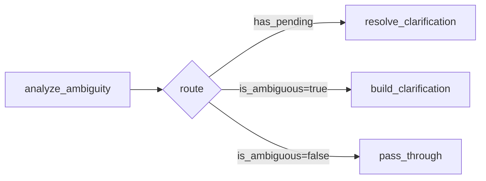

# 챗봇 하이브리드 아키텍처 (2026-02-26)

현재 `dev-final/frontend` 기준 실제 구현 흐름입니다.

## 변경 핵심

- 기존 선형 엔진에 LangGraph 기반 모호성 오케스트레이터가 추가됨
- 모호한 질문은 즉시 답변하지 않고 `clarification` SSE + Quick Reply 칩으로 되질문
- 매 턴 KST 기준 시간 컨텍스트를 시스템 메시지에 주입
- 웹검색(Perplexity)은 항상 선호 호출, 실패 시 fail-open으로 내부 데이터만으로 진행
- Chart-First 경로 유지 (`viz_intent` -> `visualization` -> 텍스트 분석)

## End-to-End 아키텍처

```mermaid
flowchart TD
    U[사용자 입력] --> FE[TutorContext.sendMessage]
    FE --> API[POST /api/v1/tutor/chat SSE]
    API --> ENG[tutor_engine.generate_tutor_response_stream]

    ENG --> PREV[이전 대화 로드]
    ENG --> PC{Redis pending clarification 존재?}

    PC -- Yes --> RESOLVE[resolve_effective_message]
    RESOLVE --> CLR[Redis pending 삭제]
    CLR --> EMSG[effective_message 확정]

    PC -- No --> ORCH[run_ambiguity_orchestrator]
    ORCH --> AMB{is_ambiguous?}
    AMB -- Yes --> CBUILD[clarification question/options 생성]
    CBUILD --> CSAVE[Redis tutor:clarify:{session_id}\nTTL 15분 저장]
    CSAVE --> CDB[(TutorMessage: message_type=clarification)]
    CDB --> SSE_C[event: clarification]
    SSE_C --> UI_C[프론트 Quick Reply 칩 렌더]
    UI_C --> DONE_C[event: done]

    AMB -- No --> EMSG

    EMSG --> GCTX[Glossary/Case/Report/Stock 컨텍스트 수집]
    GCTX --> GUARD[Guardrail 검사]
    GUARD --> ALLOW{허용 여부}
    ALLOW -- Block --> BLOCKMSG[text_delta 차단 메시지]
    BLOCKMSG --> DB_BLOCK[(user/assistant 저장)]
    DB_BLOCK --> DONE_B[event: done]

    ALLOW -- Allow --> WEB[Perplexity 웹검색]
    WEB --> WEBOK{성공?}
    WEBOK -- Yes --> WCTX[웹 요약 + citations -> sources]
    WEBOK -- No --> FAILOPEN[로그만 남기고 내부 데이터로 진행]

    WCTX --> KST[동적 컨텍스트 구성 + KST 시간 주입]
    FAILOPEN --> KST

    KST --> VCHK{Chart-First 필요?}
    VCHK -- Yes --> VCLS[차트 타입 분류]
    VCLS --> VUNSUP{지원 가능?}
    VUNSUP -- No --> VFB[텍스트 fallback 안내]
    VUNSUP -- Yes --> VINT[event: viz_intent]
    VINT --> VGEN[차트 JSON 생성]
    VGEN --> VSSE[event: visualization]

    VCHK -- No --> LLM
    VFB --> LLM[OpenAI SSE text_delta 생성]
    VSSE --> LLM

    LLM --> TDELTA[event: text_delta 스트리밍]
    TDELTA --> SAVE[(user + optional visualization + assistant 저장)]
    SAVE --> DONE[event: done + sources]
    DONE --> FE_RENDER[Frontend MessageBubble 렌더]
```

## LangGraph 내부 노드 (모호성 오케스트레이터)



## 프론트 수신 이벤트

- `thinking`
- `tool_call`
- `viz_intent`
- `clarification`
- `visualization`
- `text_delta`
- `done`
- `error`

