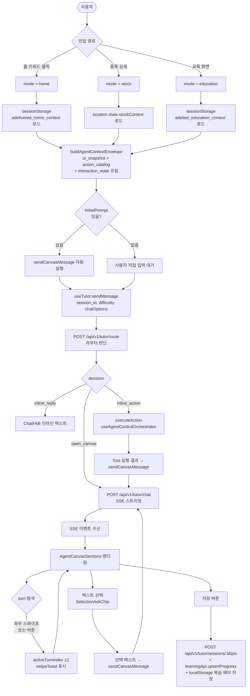
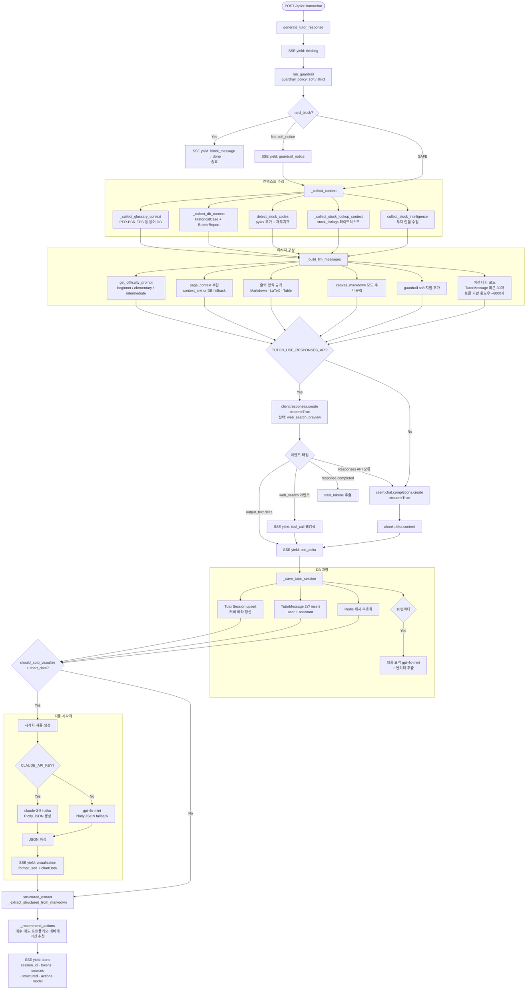
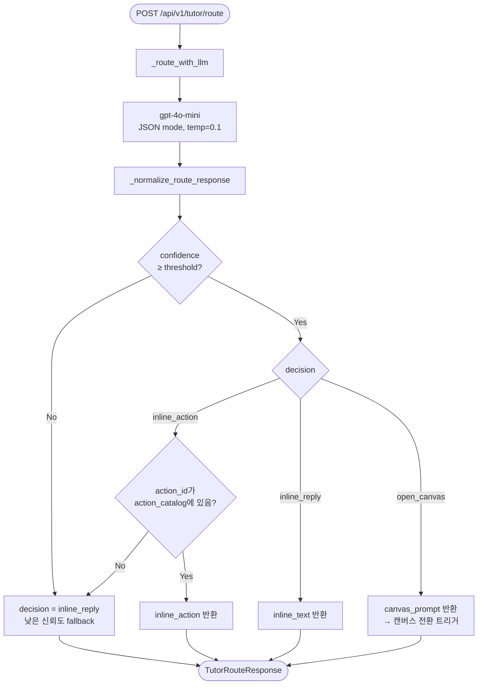
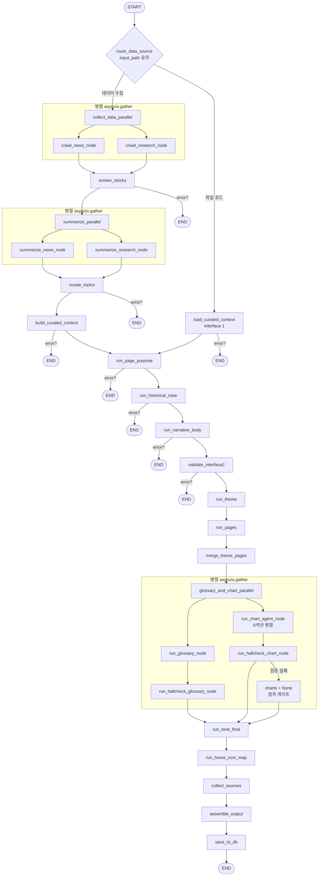
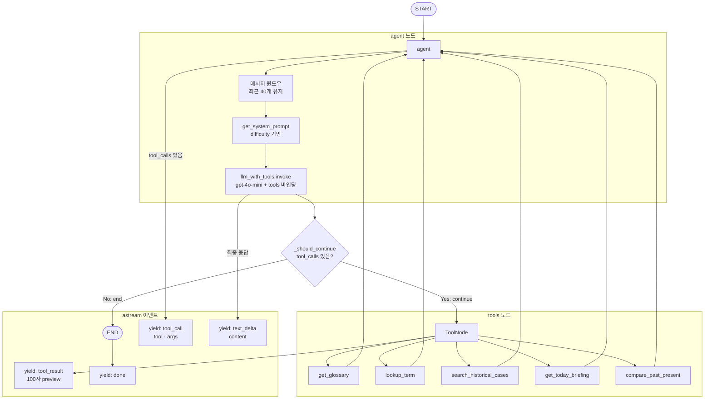
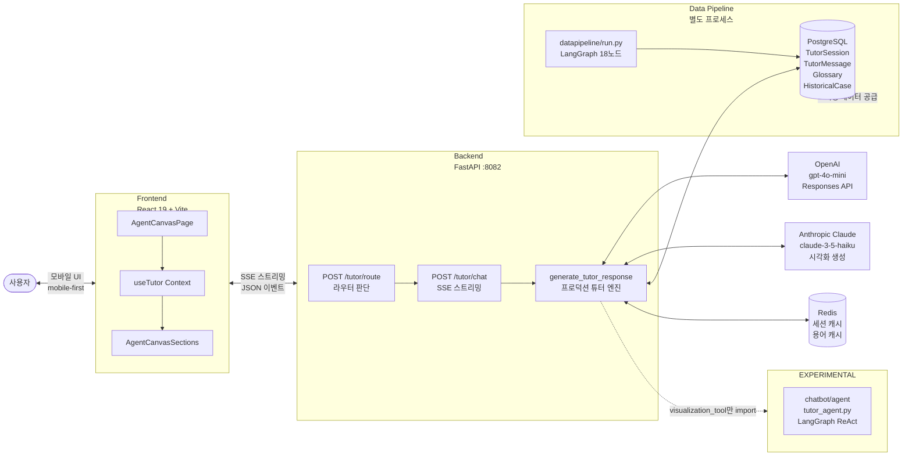

# 에이전트 & 챗봇 전체 흐름 (Mermaid)

> 최종 업데이트: 2026-02-23

---

## 1. Agent Canvas — 프론트엔드 진입 흐름

---

## 2. 프로덕션 튜터 응답 흐름 (`/api/v1/tutor/chat`)

---

## 3. 라우터 판단 흐름 (`/api/v1/tutor/route`)

---

## 4. 데이터 파이프라인 LangGraph (`datapipeline/graph.py`)

---

## 5. 실험적 튜터 에이전트 LangGraph (`chatbot/agent/tutor_agent.py`)

> **[EXPERIMENTAL]** 프로덕션 미사용. ReAct 패턴 구현.

---

## 시스템 전체 연결 구조

