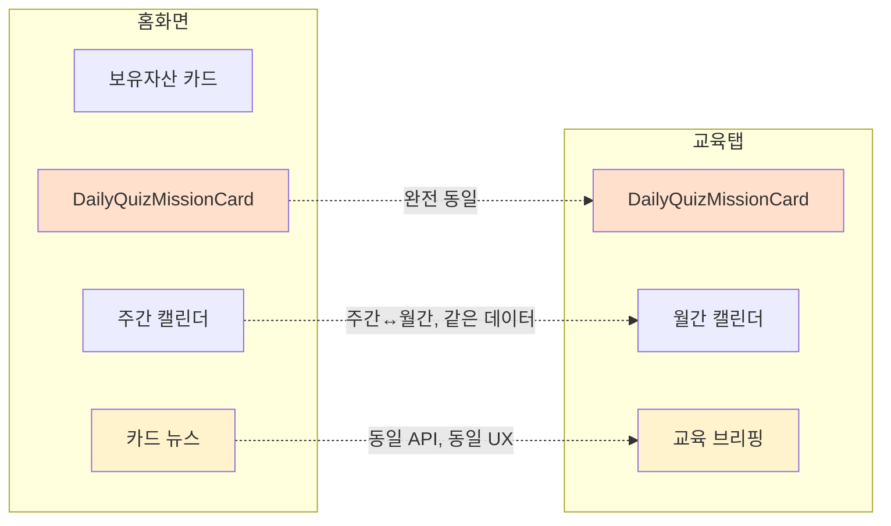
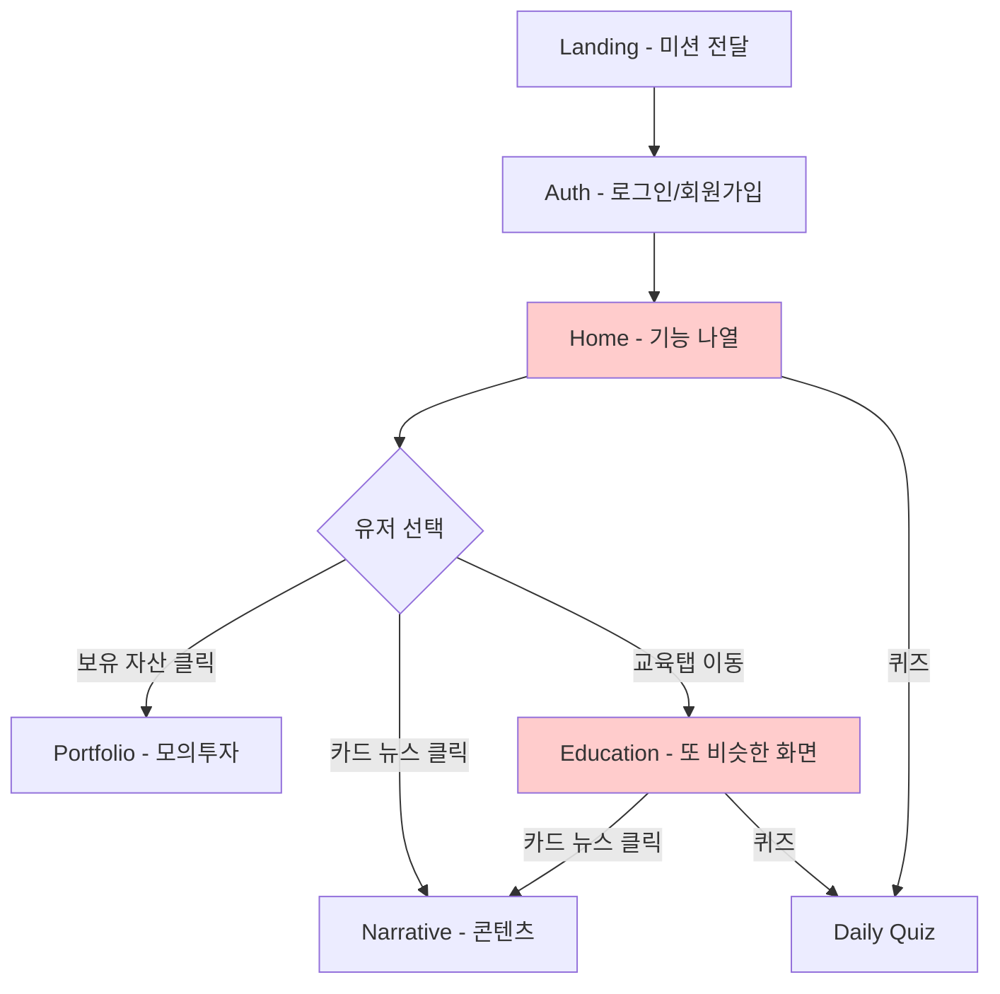
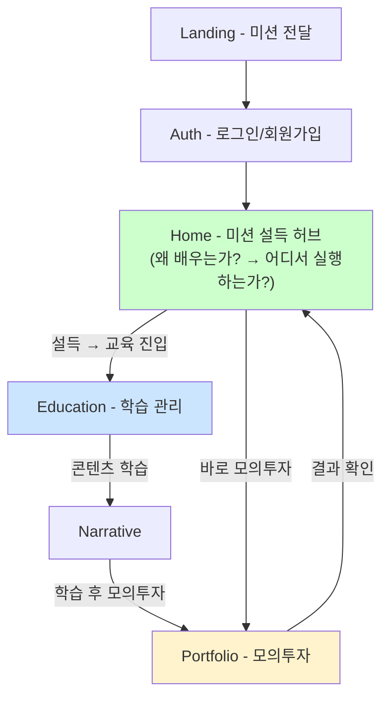

# PM 의사결정 로그 #001: 홈화면 리디자인 — "미션 설득형" 전환

> **작성 일자**: 2026-02-25  
> **PM**: 본인 (프로덕트 오너)  
> **상태**: 🟡 문제 정의 단계  
> **관련 페이지**: [Home.jsx](file:///home/ubuntu/adelie-investment/frontend/src/pages/Home.jsx) · [Education.jsx](file:///home/ubuntu/adelie-investment/frontend/src/pages/Education.jsx) · [Portfolio.jsx](file:///home/ubuntu/adelie-investment/frontend/src/pages/Portfolio.jsx)

---

## 1. 문제 정의 (Problem Statement)

### 1-1. 핵심 문제

> **홈화면과 교육탭이 기능적으로 중복되어, 유저가 "아델리가 뭘 하는 앱인지"를 직관적으로 이해하지 못하고, 핵심 루프(교육 → 모의투자)에 진입하지 않는다.**

### 1-2. 현재 상태 (As-Is) 분석

#### 하단 네비게이션 구조
```
[ 교육 ] — [ 홈 ] — [ 모의투자 ]
```

#### 홈화면 (`Home.jsx`) 구성 요소

| 순서 | 섹션 | 역할 | 교육탭과 중복? |
|------|------|------|---------------|
| 1 | 보유 자산 카드 (오렌지) | 총 자산 표시 + "모의투자 하러가기" CTA | ❌ 홈 전용 |
| 2 | 학습 스케줄 (주간 캘린더) | 이번 주 활동 현황 + 7일 달력 | ⚠️ 교육탭에 월간 버전 존재 |
| 3 | **오늘의 미션 (DailyQuizMissionCard)** | 퀴즈 풀고 투자 지원금 받기 | ✅ **완전 동일** |
| 4 | 오늘의 카드 뉴스 | keywordsApi 기반 카드 3장 | ✅ **거의 동일** (교육탭: "오늘의 교육 브리핑") |

#### 교육탭 (`Education.jsx`) 구성 요소

| 순서 | 섹션 | 역할 | 홈화면과 중복? |
|------|------|------|---------------|
| 1 | **오늘의 미션 (DailyQuizMissionCard)** | 퀴즈 풀고 투자 지원금 받기 | ✅ **완전 동일** |
| 2 | 활동 캘린더 (월간) | 월별 활동 현황 + 날짜별 상세 | ⚠️ 홈에 주간 버전 존재 |
| 3 | 오늘의 교육 브리핑 | keywordsApi 기반 카드 3장 | ✅ **거의 동일** |

#### 핵심 중복 요소 정리



### 1-3. 왜 문제인가?

1. **유저 혼란**: 홈에서 보는 것과 교육탭에서 보는 것이 거의 같아, 두 탭을 오갈 이유가 없음
2. **투자 앱 오해**: 홈 상단 "보유 자산 카드"가 가장 큰 시각적 비중 → 유저가 이 앱을 "투자 앱"으로 인식할 가능성 높음
3. **교육 루프 실패**: 아델리의 핵심 가치인 "교육 → 모의투자 실행"의 흐름이 홈에서 명확히 전달되지 않음
4. **미션 미분화**: `DailyQuizMissionCard`가 홈/교육 양쪽에 그대로 중복 배치. 유저 입장에서 "어디서 하는 게 맞지?" 하는 혼란

### 1-4. 유저 행동 관찰 (정성적)

- 사용자들이 **모의투자**나 **오락성 기능**(퀴즈)만 주로 사용
- 교육 콘텐츠 자체에 대한 자발적 진입이 적음
- 교육 느낌을 홈에 녹이려다 보니 오히려 두 탭이 겹침

---

## 2. 가설 (Hypothesis)

> **"홈화면에서 기능을 나열하는 대신, 아델리의 미션과 학습 철학을 설득력 있게 전달하면, 유저가 교육 → 모의투자 루프에 더 적극적으로 진입할 것이다."**

### 가설의 근거

| 근거 | 설명 |
|------|------|
| **기능 나열의 한계** | 처음에는 기능을 많이 넣으면 사용률이 올라갈 것이라 생각했지만, 유저는 오락적 요소만 소비하고 교육에는 진입하지 않음 |
| **미션 → 행동 전환** | Landing 페이지는 "쉽고 깊은 금융 이야기"라는 미션을 잘 전달하고 있으나, 로그인 이후 홈에서는 그 메시지가 사라짐 |
| **중복 제거 → 역할 명확화** | 홈 = 미션 설득 + 핵심 전환점, 교육 = 학습 관리 허브, 모의투자 = 실행의 장으로 역할을 분리하면 각 탭의 존재 이유가 명확해짐 |

### 가설이 맞다면 예상 결과

- 홈 → 교육 전환율 ↑ (현재 측정 불가, 이벤트 로깅 필요)
- 교육 콘텐츠(Narrative) 완독률 ↑
- 교육 → 모의투자 순차 진입 비율 ↑
- 교육탭 DAU ↑

---

## 3. 현재 유저 플로우 vs 이상적 유저 플로우

### As-Is 플로우



#### 문제
- 홈과 교육이 비슷한 내용 → 유저가 두 탭의 차이를 모름
- "왜 이걸 학습해야 하는지" 동기 부여 없이 기능만 노출
- 홈에서 보유 자산이 가장 눈에 띄어 "투자 앱" 인상

### To-Be 플로우 (가설 기반)



#### 핵심 변화
- 홈 = "왜 + 어떻게"를 전달하는 **미션 설득** 공간
- 교육 = 중복 제거 후 **학습 관리에 집중**하는 전용 허브
- 모의투자 = 학습 결과를 **행동으로 옮기는** 실행의 장

---

## 4. 다음 단계 (Next Steps)

> [!IMPORTANT]
> 지금 단계는 **문제 정의 완료**. 아래는 순차적으로 진행할 항목입니다.

- [ ] 홈화면 리디자인: 미션 설득형 컨셉 상세 설계
  - 어떤 메시지·비주얼로 미션을 전달할 것인가?
  - 교육 진입 CTA를 어디에 어떻게 배치할 것인가?
  - 보유 자산 카드를 어떻게 처리할 것인가? (축소? 이동? 재해석?)
- [ ] 교육탭 역할 재정의: 홈에서 제거된 요소를 교육탭에 집중
- [ ] 이벤트 로깅 설계: 가설 검증을 위한 정량 지표 수집 체계
- [ ] A/B 테스트 설계 (가능하다면)
- [ ] 구현 및 배포
- [ ] 정량적 측정 및 회고

---

## 5. 측정 계획 (Measurement Plan)

### 5-1. 핵심 지표 (Primary Metrics)

| 지표 | 정의 | 측정 방법 | 현재 값 | 목표 |
|------|------|-----------|---------|------|
| **홈 → 교육 전환율** | 홈 방문 대비 교육탭 진입 비율 | 이벤트 로깅 (click_education_from_home) | 미측정 | 베이스라인 대비 +20% |
| **교육 콘텐츠 완독률** | Narrative 5단계 중 마지막 단계 도달 비율 | Narrative step 이벤트 로깅 | 미측정 | 베이스라인 대비 +15% |
| **교육 → 모의투자 전환율** | 교육 완료 후 24h 내 모의투자 실행 비율 | 세션/시간 기반 이벤트 연결 | 미측정 | TBD |

### 5-2. 보조 지표 (Secondary Metrics)

| 지표 | 정의 |
|------|------|
| 홈화면 체류 시간 | 미션을 읽는 시간 증가 여부 |
| 교육탭 DAU | 교육탭 일일 활성 사용자 수 |
| 퀴즈 참여율 | 일일 퀴즈 참여 비율 |
| 보유 자산 카드 탭률 | 보유 자산에 대한 관심도 (축소 후 감소 여부) |

### 5-3. 가드레일 지표 (Guardrail Metrics)

| 지표 | 우려 사항 |
|------|----------|
| 전체 DAU/WAU | 홈 변경으로 전체 이탈 발생 여부 |
| 모의투자 거래 건수 | 보유 자산 CTA 축소로 모의투자 자체 감소 여부 |
| 퀴즈 완료율 | 퀴즈 위치 변경으로 참여율 감소 여부 |

---

## 6. 변경 이력 (Changelog)

| 날짜 | 내용 | 단계 |
|------|------|------|
| 2026-02-25 | 문제 정의 및 As-Is 분석 완료. 가설 수립. 측정 계획 초안 작성. | 🟡 문제 정의 |
| 2026-02-25 | [아이디에이션 문서](file:///home/ubuntu/adelie-investment/docs/pm-decision-log/001-home-redesign-ideation.md) 작성. 3가지 컨셉(학습 루프/매거진/미션 대시보드) + 하이브리드 추천안 도출. | 🟡 아이디에이션 |
